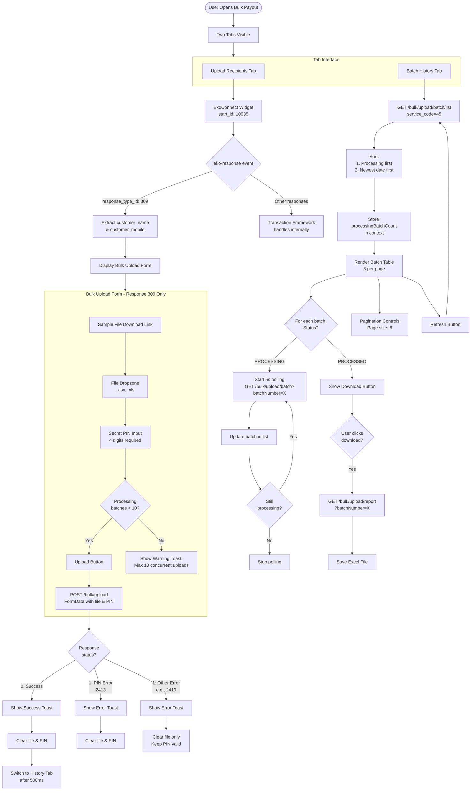

# Bulk Payout Feature Documentation

## 1. Overview
The **Bulk Payout** feature allows agents to perform batch IMPS payout transactions. The feature has two main tabs: **Upload Recipients** and **Batch History**. The Upload tab integrates with **EkoConnect Widget** (transaction framework) for customer verification, and conditionally displays the bulk upload interface based on the response type.

---

## 2. User Flow & Logic

### Initial View
* **Action:** User navigates to Bulk Payout page (`/products/bulk-payout`)
* **UI:** Two tabs are visible:
    * **Upload Recipients Tab** - Contains EkoConnect widget for customer verification
    * **Batch History Tab** - Shows batch transaction history with real-time status updates

### Upload Recipients Tab Flow

#### Step 1: Customer Verification (EkoConnect Widget)
* **Component:** `EkoConnectWidget` with `start_id={10035}`
* **Purpose:** Customer search and verification flow managed by transaction framework
* **Event Handling:** Listens for `eko-response` custom event
* **Success Response (`response_type_id: 309`):**
    * Customer verified successfully
    * Extract `customer_name` and `customer_mobile` from response
    * Store in context state
    * Display bulk upload interface below widget

#### Step 2: Bulk Upload Interface (Conditional - Response 309 only)
* **Trigger:** Only shown when `response_type_id === 309` it means customer found
* **UI Elements:**
    * **Sample File Download:** Link to download Excel template (`sample_bulk_payout.xlsx`)
    * **File Dropzone:** Accept `.xlsx` and `.xls` files only
    * **Secret PIN Input:** PinTwin component (4-digit PIN required)
    * **Upload Button:** Submits batch for processing
* **Upload Limit:** Maximum 10 concurrent processing batches
    * System checks `processingBatchCount` before allowing upload
    * Shows warning toast if limit exceeded

#### Upload Workflow
1. User downloads sample file and prepares batch data
2. User selects file via Dropzone
3. User enters 4-digit Secret PIN
4. User clicks Upload button
5. System validates:
    * File is selected
    * PIN is 4 digits
    * Processing batch count < 10
6. API call with FormData containing:
    * `sender_name`: Customer name from EkoConnect response
    * `user_code`: Agent's user code
    * `pintwin`: Encoded PIN value
    * `client_ref_id`: Unique reference (timestamp + random)
    * `customer_id`: Customer mobile number
    * `service_code`: "45" (Bulk Payout service)
    * `file`: Uploaded Excel file
7. Response Handling:
    * **Success (status: 0):** 
        * Show success toast
        * Reset form (file, PIN)
        * Switch to Batch History tab after 500ms
    * **PIN Error (response_type_id: 2413):**
        * Show error toast
        * Clear file and PIN
        * User must re-enter both
    * **Other Errors (e.g., 2410: duplicate file):**
        * Show error toast
        * Clear file only
        * Keep PIN valid for retry

### Batch History Tab Flow

#### Initial Load
* **Trigger:** User switches to Batch History tab or after successful upload
* **API Call:** Fetch batch list with `service_code=45`
* **Sorting:**
    1. Processing batches first
    2. Then by upload date (newest first)
* **Context Update:** Store `processingBatchCount` for upload limit check

#### Real-Time Status Updates (Polling)
* **Target:** Batches with `PROCESSING` status
* **Mechanism:** 
    * Identify processing batches on initial load
    * Start 5-second interval polling per batch number
    * Fetch single batch data via API
    * Update batch in list if data received
    * Stop polling when batch reaches `PROCESSED` status
* **Status Derivation:**
    * `PROCESSING`: `(successCount + failureCount + pendingCount + invalidRecords) < totalRecords`
    * `PROCESSED`: All records accounted for

#### Batch History UI
* **Table Columns:**
    * Upload Date (formatted timestamp)
    * Customer (avatar + name)
    * Records (total count)
    * Amount (formatted with ₹ symbol and locale)
    * Status (badge with icon, blinking animation for processing)
    * Approved (green text)
    * Invalid (red text)
    * Success (green text)
    * Pending (yellow text)
    * Failed (red text)
    * Action (download button or spinner)
* **Processing Status Badge:**
    * Blue color scheme
    * Blinking clock icon
    * Shows progress: `{processed}|{total}` (e.g., "05|50")
* **Processed Status Badge:**
    * Green color scheme
    * Check icon
* **Download Action:**
    * Only visible for `PROCESSED` batches
    * Shows spinner for `PROCESSING` batches
    * Calls download report API with batch number
    * Saves Excel file with transaction details

#### Pagination & Refresh
* **Page Size:** 8 batches per page
* **Refresh Button:** Manual refresh to fetch latest batch list
* **Empty State:** Shows inbox icon and refresh button when no batches exist

---

## 3. Technical Implementation

### Component Structure
```
page-components/products/bulk-payout/
├── BulkPayout.tsx                    # Main container with context provider
│                                     # - EkoConnect widget integration
│                                     # - eko-response event listener
│                                     # - Conditional UploadRecipients rendering
│                                     # - Tab navigation
├── components/
│   ├── UploadRecipients.tsx          # Bulk upload form
│   │                                 # - Sample file download link
│   │                                 # - Dropzone for Excel upload
│   │                                 # - PinTwin (4-digit PIN)
│   │                                 # - Upload limit check (10 batches)
│   │                                 # - Form submission with FormData
│   └── BatchHistory.tsx              # Transaction history
│                                     # - Batch list table with sorting
│                                     # - Real-time polling for processing batches
│                                     # - Status derivation logic
│                                     # - Download report functionality
│                                     # - Pagination (8 per page)
├── context/
│   ├── BulkPayoutContext.tsx         # Context provider and hooks
│   │                                 # - useBulkPayoutContext (raw state/dispatch)
│   │                                 # - useBulkPayout (convenient actions)
│   ├── reducer.ts                    # State transitions
│   │                                 # - SET_CUSTOMER_PARAMS
│   │                                 # - SET_TAB
│   │                                 # - SET_PROCESSING_BATCH_COUNT
│   └── types.ts                      # TypeScript definitions
│                                     # - BulkPayoutState
│                                     # - Action types
│                                     # - CustomerParams
│                                     # - ActiveTab
└── index.ts                          # Module exports
```

### Context State Management
```typescript
interface BulkPayoutState {
	customerParams: {
		customerName: string;
		customerNumber: string;
	} | null;
	activeTab: "upload" | "history";
	processingBatchCount: number;
}
```

### Key APIs

| API Name | Endpoint | Method | Purpose |
| :--- | :--- | :--- | :--- |
| **Upload Batch** | `/bulk/upload` | POST | Submit batch file with customer & PIN |
| **Batch List** | `/bulk/upload/batch/list?service_code=45` | GET | Fetch all batches for agent |
| **Single Batch** | `/bulk/upload/batch?batchNumber={id}` | GET | Poll single batch status (5s interval) |
| **Download Report** | `/bulk/upload/report?batchNumber={id}` | GET | Download Excel with transaction details |

**Headers Required:**
```javascript
{
	"Authorization": "Bearer {accessToken}",
	"tf-req-uri-root-path": "/api/v1",
	"tf-req-uri": "{endpoint}",
	"tf-req-method": "{method}"
}
```

### Upload Request Format
```typescript
// FormData structure
{
	formdata: URLSearchParams({
		sender_name: "Customer Name",
		user_code: "AGENT123",
		pintwin: "encoded_pin_value",
		client_ref_id: "1234567890123",
		customer_id: "9876543210",
		service_code: "45"
	}),
	file: File // Excel file
}
```

### Batch Status Derivation Logic
```typescript
const deriveBatchStatus = (batch: ApiBatch): "PROCESSING" | "PROCESSED" => {
	const processedTotal = 
		batch.successCount + 
		batch.failureCount + 
		batch.pendingCount + 
		batch.invalidRecords;
	
	return processedTotal !== batch.totalRecords 
		? "PROCESSING" 
		: "PROCESSED";
};
```

---

## 4. Business Rules

### Upload Constraints
* **File Format:** `.xlsx` or `.xls` only
* **PIN:** Exactly 4 digits required
* **Concurrent Limit:** Maximum 10 batches in `PROCESSING` status
* **Sample Template:** Must follow structure in `sample_bulk_payout.xlsx`

### Error Handling
* **PIN Error (2413):** Clear both file and PIN, user must re-enter
* **Duplicate File (2410):** Clear file only, keep PIN valid
* **Limit Exceeded:** Show warning toast, prevent upload
* **Network Error:** Show error toast with technical message

### Status Updates
* **Polling Frequency:** 5 seconds for processing batches
* **Auto-Stop:** Polling stops when batch reaches `PROCESSED` status
* **Tab Context:** Only polls when Batch History tab is active

### Download Feature
* **Availability:** Only for `PROCESSED` batches
* **File Format:** Excel (`.xlsx`)
* **Content:** Per-transaction details (TID-level status)

---

## 5. Workflow Diagram



---

## 6. Testing Considerations

### Unit Tests
* **BulkPayout.tsx:**
    * Renders two tabs correctly
    * Listens for eko-response event
    * Extracts customer data from event detail
    * Conditionally shows UploadRecipients when response_type_id is 309
* **UploadRecipients.tsx:**
    * Sample file download link works
    * Dropzone accepts only .xlsx/.xls
    * PinTwin validates 4-digit requirement
    * Upload button disabled when conditions not met
    * Shows warning when processing limit exceeded
    * Clears form correctly on success
    * Handles PIN error vs other errors differently
* **BatchHistory.tsx:**
    * Fetches and displays batch list
    * Sorts batches correctly (processing first, then date)
    * Derives status from counts accurately
    * Starts polling for processing batches
    * Stops polling when batch becomes processed
    * Download button only visible for processed batches
    * Pagination works correctly

### Integration Tests
* Full upload flow from EkoConnect to form submission
* Real-time polling updates batch status in table
* Tab switching preserves state correctly
* Processing count limit enforced across tabs

### Edge Cases
* Multiple batches transitioning from processing to processed simultaneously
* Polling cleanup when user switches away from History tab
* Form state reset after different error types
* Upload limit check with exactly 10 processing batches

---

## 7. Future Enhancements
* **Batch Validation:** Preview invalid records before submission
* **Progress Tracking:** Show upload progress bar for large files
* **Notification:** Toast/alert when processing batch completes
* **Filters:** Filter history by date range, status, customer
* **Export:** Download batch list as CSV
* **Retry:** Retry failed transactions from batch report

---

## 8. References
* **API Documentation:** [Bulk Payout API Specs](https://docs.google.com/document/d/1s9O81RN6V4DU2cuZYqdx2Et-CpGFl0LimyV3txq64vM/edit?tab=t.0)
* **EkoConnect Widget:** See `components/EkoConnectWidget` and `TestPage.jsx` for usage examples
* **Sample File:** [Download Template](https://files.eko.co.in/docs/sample_files/bulk-upload/bulk_imps_sample.xlsx)