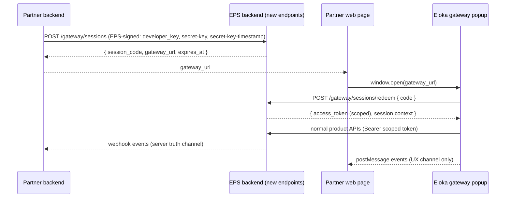

# Gateway v2 — API Contract (EPS Backend)

**Audience:** EPS core backend team.
**Consumer:** Eloka webapp (`wlc-webapp`) gateway frontend.
**Status:** Draft for backend review — open questions at the end.
**Date:** 2026-08-12

## 1. Purpose

Let an EPS (API) partner open a pre-built Eloka product page (starting with the KYC & Verification family) in a popup/new tab for one of their onboarded merchants, without any Eko credential ever reaching the browser.

Two authentication modes:

- **Mode A — session exchange (recommended for EPS partners):** the partner's backend performs a **signed session exchange** → receives a **one-time code** → opens the popup at `https://<eloka-host>/gateway/products/<product-path>?code=<one-time-code>` → the webapp **redeems** the code for a **scoped, short-lived access token** and renders the product page. Requires the two new endpoints in §2–§3.
- **Mode B — direct access_token (simplified):** the caller already holds a valid Eloka `access_token` and passes it straight to the popup URL. **Zero new backend endpoints.** See §3b for semantics and tradeoffs.

Sections §2–§8 describe Mode A unless stated otherwise.



## 2. Endpoint 1 — Create gateway session (partner → EPS)

`POST /gateway/sessions`

**Auth:** standard EPS request signing, identical to every other EPS API — headers `developer_key`, `secret-key` (= base64(HMAC-SHA256(timestamp, base64(access_key)))), `secret-key-timestamp` (ms epoch), `content-type: application/json`. See [How auth works](https://eps.eko.in/docs/how-auth-works). Partner org is fixed `org_id = 1`; the partner is identified by `initiator_id`.

**Request body:**

| Field | Type | Required | Notes |
|---|---|---|---|
| `initiator_id` | string | yes | Partner identifier (mobile), as in all EPS calls |
| `user_code` | string | yes | The partner's **already-onboarded** merchant who will use the page. Reject with a distinct error if unknown / not onboarded (partner should chain the onboarding gateway first) |
| `product` | string | yes | Product path to expose, e.g. `products/kyc-verification` or a deep link `products/kyc-verification/pan`. Must match the agreed exposable-product allowlist (v1: the kyc-verification family only) |
| `client_ref_id` | string | yes | Partner's correlation id. Echoed verbatim in every webhook and every popup `postMessage` event. Recommend uniqueness per session but do not enforce |
| `theme` | object | no | `{ "primary": "#RRGGBB", "accent": "#RRGGBB" }`. Passed through opaquely to the frontend in the redeem response; backend only validates hex format |
| `callback_url` | string (https) | no | Webhook endpoint for this session's events (see §5). If the partner has a globally registered gateway webhook, this overrides it for the session |

**Response `200`:**

```json
{
	"session_code": "<opaque one-time code, ≥ 128 bits entropy>",
	"gateway_url": "https://<eloka-host>/gateway/products/kyc-verification?code=<session_code>",
	"expires_at": "<ISO-8601>",
	"code_expires_in_seconds": 300
}
```

**Semantics:**

- `session_code` is **single-use**: first successful redeem burns it; any further redeem attempt returns an error and SHOULD invalidate the whole session (replay signal).
- Unredeemed codes expire in ~5 minutes.
- `gateway_url` host is environment-specific (UAT / production), mirroring EPS environments.

## 3. Endpoint 2 — Redeem code (webapp → EPS)

`POST /gateway/sessions/redeem`

**Auth:** none beyond the code itself (browser call from the popup). CORS: allow the Eloka webapp origins only.

**Request body:** `{ "code": "<session_code>" }`

**Response `200`:**

```json
{
	"access_token": "<scoped session token>",
	"token_expires_in_seconds": 3600,
	"product": "products/kyc-verification",
	"user_code": "...",
	"client_ref_id": "...",
	"theme": { "primary": "#0F62FE", "accent": "#FF6B00" },
	"details": { "...same profile shape the normal login/refresh-profile returns for this user_code..." }
}
```

`details` must be consumable by the webapp's existing session bootstrap (same shape as a login response), so product pages hydrate unmodified. If returning the full profile here is awkward, minimum viable alternative: return the token only and guarantee `POST /authentication/refresh-profile` works with it — flagging as **Open question Q1**.

**Errors:** distinct codes for: unknown code, expired code, already-redeemed code (replay). Replay SHOULD also fire a `session.replay_detected` webhook.

## 3b. Mode B — direct access_token (no new endpoints)

The caller opens `https://<eloka-host>/gateway/products/<product-path>?access_token=<token>`. The webapp performs the same silent login the Eloka landing page (`/`) already performs for `?access_token=`: it strips the credential from the URL, fetches the user profile with the token (`POST /authentication/refresh-profile`), and uses that token for all subsequent API calls until it expires. Token expiry is terminal — no refresh; the caller opens a fresh popup with a new token.

**Requires no backend work.** It reuses the existing profile endpoint, existing token semantics, and the normal product APIs. It is documented here only so the backend team knows both modes exist and that the scoped-token enforcement in §4 applies to Mode A tokens only.

**Tradeoffs vs Mode A — read before choosing this mode:**

| Property | Mode A (code exchange) | Mode B (direct token) |
|---|---|---|
| Credential in URL | One-time code, burnt on first redeem | **Full access token** — anyone who captures the URL (history, server/CDN logs, referrer) holds the session until expiry. Keep token TTLs short; treat the URL itself as the credential |
| API scope | Backend-enforced product allowlist | **None** — token has whatever power it normally has; product containment is frontend-only (UI fencing, not security) |
| Server session record | Yes — webhooks, `client_ref_id` echo, replay detection | **None** — no webhooks; results only via popup `postMessage` + polling existing APIs |
| Billing | Partner EPS wallet via session `initiator_id` | Follows the token's own user context — **assumption, needs backend confirmation** (open question Q6) |
| Intended use | EPS partner production integrations | Internal/trusted integrations, pilots, demos |

Ambiguous input: if a URL carries both `access_token` and `code`, the frontend uses `access_token` (direct mode), discards the code unredeemed, and strips both parameters from the URL.

## 4. Scoped token — required enforcement

The redeemed `access_token` is **not** a general session token. Backend must enforce:

| Property | Requirement |
|---|---|
| Scope | Only the API set required by the session's `product` (product → API allowlist maintained backend-side, agreed with frontend per product) + `refresh-profile`. Any other API → `403` with a distinct `gateway_scope_violation` error code |
| TTL | 30–60 min absolute (recommend 60 for long KYC flows). **No refresh / re-issue** — expiry is terminal; partner initiates a new session |
| Identity | Bound to `(initiator_id, user_code)` from the exchange |
| Billing | Every chargeable call debits the **partner's EPS wallet** (by session `initiator_id`) — `user_code` is attribution only, never the payer (see §6) |
| Context | Token (or server session record) carries `client_ref_id` + `product` so webhooks and ledger entries can echo them |

## 5. Webhooks (truth channel)

Popup `postMessage` is UX-only and spoofable/lossy; the webhook is the partner's source of truth. Events POSTed to the session's `callback_url` (or registered default), JSON body:

```json
{
	"event": "gateway.verification.completed",
	"session_id": "<server-side session id>",
	"client_ref_id": "...",
	"initiator_id": "...",
	"user_code": "...",
	"product": "products/kyc-verification/pan",
	"timestamp": "<ISO-8601>",
	"data": { "...event-specific payload, e.g. verification result + tid..." }
}
```

**Minimum event set (v1):**

| Event | When |
|---|---|
| `gateway.session.redeemed` | Code redeemed, popup live |
| `gateway.verification.completed` | A verification call finished (success or failure) — includes result + transaction id + fee charged |
| `gateway.session.expired` | Token TTL hit |
| `gateway.session.replay_detected` | Redeem attempted on a burnt code |

**Delivery:** signed (recommend `X-Eko-Signature: base64(HMAC-SHA256(body, base64(access_key)))` — same primitive partners already implement), retried with backoff on non-2xx (suggest 3 attempts). Partner endpoint must be idempotent on `(session_id, event, data.tid)`.

Explicit non-goal (v1): no "abandoned" event — partner infers abandonment from `session.expired` without a completion, or from absence of events.

## 6. Billing

- Chargeable verification calls under a gateway token debit the **partner's** EPS wallet at the **partner's rate card**, exactly as if the partner had called the EPS API directly. Ledger entries must carry `user_code` and `client_ref_id` for the partner's reconciliation.
- **Frontend need:** the product UI displays the fee (incl. GST) before the user fires a verification. Under a gateway session, fee-display APIs must return the **partner's** rates, not org-1 retail rates — flagged as **Open question Q2**.

## 7. Security requirements summary

- `access_key` and `secret-key` computation stay server-side (partner's backend) — nothing signed ever appears in the popup URL. Only the one-time `code` travels in the URL, is burnt on first redeem, and expires in minutes.
- Scoped token: product API allowlist, hard TTL, no refresh (§4).
- Frontend serves gateway routes with `frame-ancestors 'none'` (popup-only v1) — no backend action, listed for completeness.
- Rate-limit `POST /gateway/sessions/redeem` per IP + per code prefix (brute-force guard).
- **Mode B exceptions:** the guarantees above do not hold for direct-token sessions — the full token transits the URL and has no product scoping (§3b). The frontend strips it from the address bar before any network call, but the original navigation has already reached browser history and server/CDN logs. Callers must use short-TTL tokens and treat gateway URLs as credentials.

## 8. Open questions for backend team

1. **Q1 — Redeem response shape:** full login-equivalent profile in the redeem response, or token-only + `refresh-profile`? Frontend works with either; full profile saves one round trip.
2. **Q2 — Partner rate card in fee-display APIs:** which existing endpoint serves fees to the product UI, and will it resolve rates by the token's `initiator_id`?
3. **Q3 — Product → API allowlist ownership:** frontend will propose the initial list for the kyc-verification family; who owns updates when a product adds an API?
4. **Q4 — Environments:** confirm UAT gateway host + whether UAT `developer_key` works unchanged on `/gateway/sessions`.
5. **Q5 — Webhook signature key:** reuse `access_key`-derived HMAC (proposed above) or a separate webhook secret per partner?
6. **Q6 — Mode B billing:** under a direct-token session, chargeable calls presumably debit whatever wallet the token's user context normally debits. Confirm actual routing per product API — the frontend fee display depends on it.

## 9. Related docs

- Frontend implementation plan: [gateway-v2-frontend-plan.md](./gateway-v2-frontend-plan.md)
- Existing gateway (onboarding): [../login-and-onboarding/onboarding.md](../login-and-onboarding/onboarding.md) §Gateway
- EPS auth: https://eps.eko.in/docs/how-auth-works
