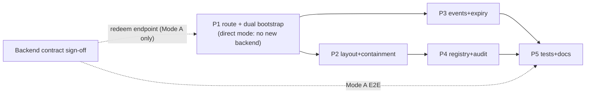

# Gateway v2 — Frontend Implementation Plan

**Repo:** `wlc-webapp`. Depends on the EPS backend contract in [gateway-v2-api-contract.md](./gateway-v2-api-contract.md) — Phase 1 can be built against a mock of `/gateway/sessions/redeem`.

**Design decisions** (2026-08-12 design session; Mode B added 2026-08-17): two auth modes — Mode A: server-side session exchange, one-time `?code=`, scoped token; Mode B: direct `?access_token=` reusing the landing page's silent-login flow, zero new backend endpoints (see contract §3b for tradeoffs); either bootstrapped as a normal session; `/gateway/products/<...path>` mirrors `/products/<...path>`; allowlist registry; nav rewrite + route fence; embeddable anywhere — popup or iframe on any parent origin (`frame-ancestors *`, decision changed 2026-08-18; originally popup-only); postMessage UX events + backend webhooks; no Eko branding, optional partner theme colors; dead-end expiry screen; v1 = kyc-verification family only.

## Phase 1 — Route, dual-mode bootstrap

Two auth modes, one route. **Direct mode ships first** — it needs zero new backend endpoints (it reuses the existing refresh-profile endpoint and token semantics), so the whole popup pipeline is demoable before the EPS exchange/redeem endpoints exist.

**New route** `pages/gateway/products/[...path].tsx`:

1. Gate on `ELOKA_GATEWAY` feature flag (existing flag; add `ELOKA_GATEWAY_PRODUCTS` only if backend wants separate rollout control).
2. **Single bootstrap state machine**, mode selected **synchronously** from `new URLSearchParams(window.location.search)` on first client render (not `router.query`, which is empty pre-hydration — same reasoning as `page-components/LandingPanel/useAutoLoginFromUrlToken.ts`). States: `DETECTING → (DIRECT_LOGIN | REDEEMING) → READY | FAILED`. No mode's network call starts before detection resolves — avoids the race where redeem logic fires while a token param sits unnoticed.
   - `?access_token=` present → **direct mode**. Precedence: if both `access_token` and `code` are present, direct mode wins; the code is discarded unredeemed.
   - else `?code=` → **redeem mode** (`POST /gateway/sessions/redeem`).
   - neither → `FAILED` ("missing credentials" screen).
   - **Strip both credential params** from the URL (awaited `router.replace(..., { shallow: true })`) before any network call, whichever mode runs — mirrors the landing-page hook; prevents later fallback/replay from the address bar.
3. **Direct mode:** reuse the landing page's silent-login flow. Extract `useAutoLoginFromUrlToken` internals into a shared primitive (e.g. `hooks/useUrlTokenLogin.ts`) **parameterized, not copied verbatim** — the landing hook swallows failures (clears session, shows the login form), while the gateway needs an explicit success/failure result to drive `READY | FAILED` and the dead-end screen. Shape: core function `loginWithUrlToken(...) → Promise<{ ok, error? }>` reused by both callers; LandingPanel keeps its current swallow-and-show-form behavior, gateway maps failure → dead-end screen (never the login form, never a redirect to `/`). Under the hood both call `loginUsingAccessToken()` (`helpers/loginHelper.js:521`) → refresh-profile → `login()` hydrates UserContext + sessionStorage.
4. **Redeem mode:** `POST /gateway/sessions/redeem` with the code, then seed the session the same way (`setandUpdateAuthTokens` + `login()` path in `contexts/UserContext.js`). Product pages must not be able to tell gateway from normal session — in either mode.
5. Store gateway context (mode, product path, `client_ref_id`, theme, expiry) in a new lightweight `GatewaySessionContext`.
   - Direct mode carries no exchange payload, so `client_ref_id`, `primary`, `accent` are accepted as **optional query params**. They are untrusted input: validate colors as strict hex (`#RRGGBB`), cap `client_ref_id` length (e.g. 64 chars) and treat it as an opaque string only ever echoed back in `postMessage` payloads — never rendered as HTML, never sent to APIs. Non-credential params stay in the URL (harmless, aids refresh).

**New module** `features/gateway/` (follow the portable-feature layout used by `features/onboarding/`):

- `gatewaySessionService.ts` — bootstrap state machine, redeem call, direct-login call, expiry timer.
- `GatewaySessionContext.tsx` — gateway-mode flag + session metadata; `useGatewaySession()` hook returns `null` outside gateway (cheap check for RouteProtecter and nav helpers).

**Render:** resolve `<...path>` against the allowlist registry (Phase 4) and render the same page component the normal route uses, wrapped in the gateway layout (Phase 2).

**Exit criteria:** direct mode — a real token pasted into `/gateway/products/kyc-verification?access_token=…` shows the live listing page with working API calls, URL stripped. Redeem mode — same result against a mocked redeem endpoint.

## Phase 2 — Layout, containment, theming

1. **Layout:** extend `layout-components/LayoutGateway` (or a `GatewayProductLayout` variant): **no header, no Eko branding, no sidebar/nav, no breadcrumbs**. Page's own title suffices.
2. **Theme:** apply optional `theme.primary` / `theme.accent` from the redeem response as Chakra theme token overrides at the gateway layout boundary. Validate hex; fall back silently.
3. **Link rewrite:** central navigation wrapper (the shared `Link`/router-push helper — audit for the actual chokepoint; if none exists, add `useGatewayRouter()` and patch the kyc-verification family to use it) maps internal `/products/*` targets → `/gateway/products/*` when `useGatewaySession()` is active.
4. **Fence:** `components/RouteProtecter/RouteProtecter.jsx` — gateway session + route outside the allowlist → full-screen "Not available in this window" screen. **Never** redirect to `/login` or `/signup` for gateway sessions.
5. **Headers (done, 2026-08-18):** `next.config.js` `headers()` split into two rules — strict `securityHeaders` on `/((?!gateway/).*)`, and `gatewaySecurityHeaders` on `/gateway/(.*)`: no `X-Frame-Options`, CSP `frame-ancestors *`, `Permissions-Policy: camera=*, geolocation=*` so any embedding parent can delegate capture via `allow="camera; geolocation"`. Gated by `NEXT_PUBLIC_ENABLE_SECURITY_HEADERS` (currently true on UAT, unset on prod). Clickjacking accepted on gateway routes: no ambient session — credentials arrive per-window, a bare framed URL dead-ends.
6. **Audit (v1 family):** grep kyc-verification feature for hardcoded escapes — `router.push("/home")`, `/history`, breadcrumb `/products` links — route them through the rewrite helper or hide in gateway mode.

## Phase 3 — Events + expiry

1. **Message helper** `features/gateway/gatewayMessenger.ts`: single `postGatewayEvent(event, data)` — targets `window.opener` (falls back to `window.parent` so iframe mode later is config, not redesign). Includes `client_ref_id`, `product`, `timestamp` in every message. `targetOrigin`: the partner origin — **v1 pragmatic choice:** `"*"` with no sensitive payload (results carry only ids/status; truth lives in webhooks), tighten to registered origins when backend adds them (contract Q-follow-up).
2. **Event set (mirror of webhook events):** `gateway.ready`, `gateway.verification.completed`, `gateway.session.expired`, `gateway.closed` (fired on `beforeunload`).
3. **Expiry:** both modes converge on the same dead-end screen: "Session expired — close this window and restart from the partner app." Fire `gateway.session.expired`. No re-auth, no refresh.
   - Timer source: redeem mode has `token_expires_in_seconds`; direct mode relies on the `token_timeout` value the normal session seeding writes (`getTokenExpiryTime` in `helpers/loginHelper.js`) — **verify during build** that it's populated for a URL-token login; if absent, skip the timer and rely on 401 interception alone.
   - 401 interception: locate the actual chokepoint (`helpers/apiHelper` fetcher vs `hooks/useRefreshToken.js`) during build — open item below. In gateway mode, `useRefreshToken`'s "Session Expired" toast + `logout()` redirect must be suppressed and replaced by the dead-end screen (a direct-token session has no `refresh_token`, so that hook is exactly the path an expiry would otherwise take).

## Phase 4 — Allowlist registry

Extend `components/GatewayWidget/GatewayProductRegistry.ts` (or supersede with `features/gateway/registry.ts`):

```ts
interface GatewayProductEntry {
	/** URL path prefix under /products/ that this entry exposes, incl. sub-pages */
	pathPrefix: string;
	/** Human label for error screens */
	label: string;
}
```

- v1 entries: `kyc-verification` family only.
- Unlisted path → 404-style "Product not available" screen.
- The same list is the source for the backend's product → API scope mapping (contract Q3): keep a comment block in the registry naming the APIs each entry needs.
- Existing `aeps` / `onboarding` keys on `/gateway/[...id]` stay untouched — old route keeps working; no migration in v1.

## Phase 5 — Verification & docs

1. **Tests:** unit — bootstrap state machine (mode detection incl. both-params precedence, neither-param failure), redeem service (burnt code, expired code, seeding), direct-login (invalid/empty/expired token, profile-fetch failure, already-logged-in user, StrictMode double-mount, popup refresh after credentials stripped), registry resolution, link-rewrite hook, query-param validation (bad hex colors, oversized client_ref_id). One integration/E2E — direct mode with a real UAT token → complete a PAN verification → assert postMessage sequence; repeat against mocked redeem.
2. **Test harness page** (dev-only): local page that plays "partner host" — opens the popup, logs postMessage events. Lives under the existing mock-data strategy (`docs/mock-data-strategy.md` patterns).
3. **Docs:** feature doc `docs/features/gateway/gateway.md` describing the final architecture (this plan is the pre-build snapshot); update `onboarding.md` gateway section cross-link.

## Dependency graph



P1–P5 fully buildable and E2E-testable in **direct mode** with no new backend endpoints (existing refresh-profile + product APIs + `ELOKA_GATEWAY` flag suffice). Mode A's redeem path runs on a mock until the backend ships; only Mode A's final E2E waits on it.

## Frontend open items

- Locate the real navigation chokepoint (shared Link wrapper vs scattered `router.push`) before committing to the rewrite approach in Phase 2.3.
- Locate the real 401/expiry chokepoint (`helpers/apiHelper` fetcher vs `hooks/useRefreshToken.js`) and verify `token_timeout` is populated on a URL-token login (Phase 3.3).
- Confirm fee-display API behavior under partner token (contract Q2) and under a direct-mode token (contract Q6) — affects kyc-verification fee labels (`eko_gst` work from recent commits).
- Decide `postMessage` targetOrigin hardening timeline with backend (registered partner origins).
