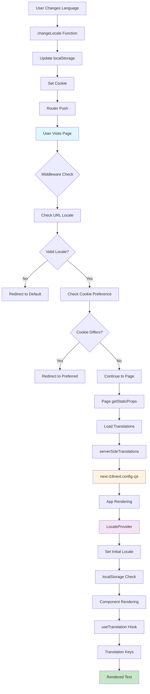

# Internationalization (i18n) Setup Completed

This document provides an overview of the internationalization (i18n) implementation for the WLC-WEBAPP project.

## � Code Flow Diagram



## 🏗️ Architecture Overview

### 1. Request Flow
```
User Request → Middleware → Locale Detection → Page Rendering → Translation Loading
```

### 2. Component Hierarchy
```
_app.tsx
├── LocaleProvider (Context)
├── appWithTranslation (HOC)
└── Page Components
    ├── useTranslation (Hook)
    ├── useLocale (Hook)
    └── Translation Keys
```

### 3. Configuration Stack
```
next-i18next.config.cjs → next.config.js → middleware.ts → LocaleContext
```

## �🚀 Implementation Summary
## i18n Configuration

This section details the Next.js i18n configuration for next-i18next.

### Configuration File: `next-i18next.config.cjs`
- Contains the complete i18n configuration in CommonJS format
- **MUST remain as .cjs extension** - required for CommonJS compatibility
- Houses all locale settings, translation paths, and i18n options

### Why `.cjs` Extension

Our project uses ES modules (`"type": "module"` in package.json), but next-i18next requires CommonJS configuration:
- **Problem**: `.js` files are treated as ES modules in our project
- **Solution**: Use `.cjs` extension for CommonJS format + explicit imports
- **Error if wrong**: `ERR_REQUIRE_ESM` when next-i18next tries to require ES module

### Usage Pattern

```javascript
import nextI18NextConfig from "../../next-i18next.config.cjs";

export async function getStaticProps({ locale }) {
  return {
    props: {
      ...(await serverSideTranslations(
        locale,
        ["common", "dashboard"],
        nextI18NextConfig
      )),
    },
  };
}
```

### ⚠️ Important Warnings
- **DO NOT** create `next-i18next.config.js` - it will cause ES module errors
- **DO NOT** change the .cjs file to .js extension
- **ALWAYS** import the config explicitly and pass it to `serverSideTranslations`
- Import path should be relative to your page location

### Examples

For pages in root `/pages/`:
```javascript
import nextI18NextConfig from "../next-i18next.config.cjs";
```
For pages in `/pages/subfolder/`:
```javascript
import nextI18NextConfig from "../../next-i18next.config.cjs";
```

The i18n setup has been successfully implemented with the following features:

### ✅ Completed Tasks

1. **Configuration Files**
   - `next-i18next.config.cjs` - CommonJS configuration for next-i18next
   - `next.config.js` - Updated with i18n settings
   - `middleware.ts` - Locale-based redirect middleware

2. **Context and Providers**
   - `contexts/LocaleContext.tsx` - Locale management with localStorage persistence
   - Updated `_app.tsx` with `LocaleProvider` and `appWithTranslation`

3. **Translation Files**
   - English (`/public/locales/en/`)
   - Hindi (`/public/locales/hi/`)
   - Gujarati (`/public/locales/gu/`)
   - Sample namespaces: `common.json` and `dashboard.json`

4. **Sample Implementation**
   - `/pages/i18n-sample/index.jsx` - Demonstration page with language switching
   - Basic tests in `__tests__/contexts/LocaleContext.test.tsx`

5. **Translation Utility**
   - `utils/withPageTranslations.ts` - Centralized getStaticProps utility
   - Standardized pattern for directory-based pages
   - Type-safe configuration with TypeScript interfaces

## 🛠️ Technical Implementation

### Supported Locales
- **English (en)** - Default locale
- **Hindi (hi)** - Secondary locale
- **Gujarati (gu)** - Secondary locale

### Key Features
- **URL-based localization** with locale prefixes (e.g., `/hi/`, `/gu/`)
- **Persistent language preferences** via localStorage and cookies
- **Fallback to English** for missing translations
- **Middleware-based redirects** based on user preferences
- **Server-side translations** using `getStaticProps`
- **Centralized translation utility** for consistent getStaticProps implementation
- **Directory-based page support** with automatic translation loading

### File Structure
```
public/locales/
├── en/
│   ├── common.json
│   └── dashboard.json
├── hi/
│   ├── common.json
│   └── dashboard.json
└── gu/
    ├── common.json
    └── dashboard.json
```

## 🎯 Usage Examples

### Basic Translation Hook
```tsx
import { useTranslation } from 'next-i18next';

const MyComponent = () => {
  const { t } = useTranslation('common');
  return <h1>{t('welcome')}</h1>;
};
```

### Language Switching
```tsx
import { useLocale } from 'contexts';

const LanguageSelector = () => {
  const { locale, changeLocale } = useLocale();
  
  return (
    <select value={locale} onChange={(e) => changeLocale(e.target.value)}>
      <option value="en">English</option>
      <option value="hi">हिंदी</option>
      <option value="gu">ગુજરાતી</option>
    </select>
  );
};
```

### Page-level Translation Setup

**Traditional Method:**
```tsx
import { serverSideTranslations } from 'next-i18next/serverSideTranslations';

export async function getStaticProps({ locale }) {
  return {
    props: {
      ...(await serverSideTranslations(locale, ['common', 'dashboard'])),
    },
  };
}
```

**Using Translation Utility (Recommended):**
```tsx
import { withPageTranslations } from 'utils/withPageTranslations';

// For directory-based pages (pages/privacy/index.js)
export { default } from "./privacy";
export const getStaticProps = withPageTranslations({
  namespaces: ["common"],
});
```

**Advanced Configuration:**
```tsx
export const getStaticProps = withPageTranslations({
  namespaces: ["common", "dashboard", "forms"],
  additionalProps: {
    staticData: { version: "1.0" },
  },
});
```

## 📁 Detailed File Structure

```
/
├── next-i18next.config.cjs          # Main i18n configuration
├── next.config.js                   # Next.js config with i18n integration
├── middleware.ts                    # Locale detection & routing
├── pages/
│   ├── _app.tsx                     # App wrapper with providers
│   ├── i18n-sample/
│   │   └── index.jsx               # Demo implementation
│   └── [other-pages]/
├── contexts/
│   └── LocaleContext.tsx           # Locale state management
├── utils/
│   └── withPageTranslations.ts     # Translation utility
├── public/locales/
│   ├── en/
│   │   ├── common.json             # Common translations
│   │   └── dashboard.json          # Page-specific translations
│   ├── hi/
│   │   ├── common.json
│   │   └── dashboard.json
│   └── gu/
│       ├── common.json
│       └── dashboard.json
└── __tests__/
    └── contexts/
        └── LocaleContext.test.tsx   # Context tests
```

## 🔧 Core Components Deep Dive

### 1. Middleware (`middleware.ts`)
**Purpose**: Handles initial locale detection and URL routing
```typescript
// Key functionality:
- Checks for locale in URL path
- Validates supported locales
- Reads cookie preferences
- Performs redirects when needed
- Excludes API routes and static files
```

### 2. Configuration (`next-i18next.config.cjs`)
**Purpose**: Central configuration for i18n settings
```javascript
// Key settings:
- defaultLocale: "en"
- locales: ["en", "hi", "gu"]
- fallbackLng: "en"
- localePath: "./public/locales"
- localeDetection: false (handled by middleware)
```

### 3. Context Provider (`LocaleContext.tsx`)
**Purpose**: Global locale state management
```typescript
// Key features:
- Provides current locale state
- Handles locale changes
- Persists preferences (localStorage + cookies)
- Triggers router navigation
```

### 4. Translation Utility (`withPageTranslations.ts`)
**Purpose**: Standardized getStaticProps for translations
```typescript
// Benefits:
- Centralized translation loading
- Type-safe configuration
- Consistent implementation pattern
- Future App Router compatibility
```

## 🔄 Request Lifecycle

### 1. Initial Page Load
```
1. User visits URL (e.g., /dashboard or /hi/dashboard)
2. Middleware intercepts request
3. Checks locale in URL path
4. Validates against supported locales
5. Checks user's cookie preference
6. Redirects if locale mismatch
7. Continues to page component
```

### 2. Page Rendering
```
1. getStaticProps runs (server-side)
2. serverSideTranslations loads translation files
3. Translation data passed as props
4. _app.tsx wraps with LocaleProvider
5. appWithTranslation HOC provides i18n context
6. Component renders with translations
```

### 3. Language Switch
```
1. User selects new language
2. changeLocale function called
3. Updates local state
4. Saves to localStorage
5. Sets browser cookie
6. Router pushes to new locale URL
7. Page re-renders with new translations
```

## 🎯 Translation Key Structure

### Namespace Organization
```json
// common.json - Global UI elements
{
  "app_name": "...",
  "welcome": "...",
  "buttons": {
    "save": "...",
    "cancel": "..."
  }
}

// dashboard.json - Page-specific content
{
  "welcome_title": "...",
  "quick_actions": "...",
  "stats": {
    "total_users": "..."
  }
}
```

### Usage Patterns
```tsx
// Single namespace
const { t } = useTranslation('common');
t('welcome') // "Welcome"

// Multiple namespaces
const { t } = useTranslation(['common', 'dashboard']);
t('common:welcome')      // "Welcome"
t('dashboard:stats.total_users') // Nested key access

// With interpolation
t('welcome_user', { name: 'John' }) // "Welcome, John!"
```

## 🧪 Testing

- **Development Server**: Running on `http://localhost:3002`
- **Sample Page**: `http://localhost:3002/i18n-sample`
- **Language URLs**: 
  - English: `http://localhost:3002/i18n-sample`
  - Hindi: `http://localhost:3002/hi/i18n-sample`
  - Gujarati: `http://localhost:3002/gu/i18n-sample`

### Testing Checklist
- [ ] All translation keys render correctly
- [ ] Language switching works without errors
- [ ] Middleware redirects function properly
- [ ] localStorage persistence works
- [ ] Cookie-based preferences are respected
- [ ] Fallback translations display for missing keys
- [ ] URL structure maintains locale prefixes
- [ ] Page reloads preserve selected language

## 🐛 Troubleshooting Guide

### Common Issues & Solutions

#### 1. ERR_REQUIRE_ESM Error
**Problem**: `next-i18next.config.js` causes ES module error
**Solution**: Use `.cjs` extension and explicit imports
```javascript
// ✅ Correct
import nextI18NextConfig from "../next-i18next.config.cjs";

// ❌ Wrong
import nextI18NextConfig from "../next-i18next.config.js";
```

#### 2. Translations Not Loading
**Problem**: serverSideTranslations not working
**Solution**: Pass config explicitly
```javascript
// ✅ Correct
serverSideTranslations(locale, namespaces, nextI18NextConfig)

// ❌ Wrong
serverSideTranslations(locale, namespaces)
```

#### 3. Language Switch Not Persisting
**Problem**: Locale resets on page reload
**Solution**: Check localStorage and cookie implementation
```typescript
// Verify in LocaleContext.tsx
localStorage.setItem("user-locale-preference", lng);
document.cookie = `NEXT_LOCALE=${lng}; path=/; max-age=31536000`;
```

#### 4. Middleware Conflicts
**Problem**: API routes getting locale prefixes
**Solution**: Ensure proper exclusions in middleware
```typescript
// Check middleware.ts config
if (pathname.startsWith("/_next") || 
    pathname.startsWith("/api") || 
    PUBLIC_FILE.test(pathname)) {
  return NextResponse.next();
}
```

### Debug Commands
```bash
# Check translation files exist
ls -la public/locales/*/

# Verify configuration
node -e "console.log(require('./next-i18next.config.cjs'))"

# Test middleware
npm run dev # Check browser network tab for redirects
```

## 📋 Next Steps

To extend the i18n implementation:

1. **Add More Translations**: Create additional JSON files for new namespaces
2. **Component Localization**: Update existing components to use translation keys
3. **Apply Translation Utility**: Use `withPageTranslations` for directory-based pages
4. **Date/Number Formatting**: Implement locale-specific formatting
5. **RTL Support**: Add right-to-left language support if needed
6. **Dynamic Imports**: Implement lazy loading for translation files

### Implementation Roadmap

#### Phase 1: Core Localization (Current)
- [x] Basic i18n setup
- [x] Three language support (en, hi, gu)
- [x] Middleware routing
- [x] Context management
- [x] Translation utility

#### Phase 2: Extended Features
- [ ] Number/currency formatting per locale
- [ ] Date/time formatting
- [ ] Pluralization rules
- [ ] Gender-based translations
- [ ] RTL language support

#### Phase 3: Advanced Features
- [ ] Dynamic translation loading
- [ ] Translation management UI
- [ ] Automated translation workflows
- [ ] Performance optimizations
- [ ] A/B testing for translations

### Adding New Languages

1. **Add locale to configuration**:
```javascript
// next-i18next.config.cjs
locales: ["en", "hi", "gu", "new-lang"]
```

2. **Create translation directory**:
```bash
mkdir public/locales/new-lang
cp -r public/locales/en/* public/locales/new-lang/
```

3. **Update middleware**:
```typescript
// middleware.ts
const SUPPORTED_LOCALES = ["en", "hi", "gu", "new-lang"];
```

4. **Add to language selector**:
```tsx
<option value="new-lang">New Language</option>
```

## 🔧 Development Guidelines

1. **Always use translation keys** instead of hardcoded strings
2. **Organize translations by namespace** (page/component specific)
3. **Use translation utility** for consistent getStaticProps implementation
4. **Keep translation keys descriptive** and consistent
5. **Test across all supported locales** before deployment
6. **Update translation files** when adding new features

## 🏗️ Translation Utility Usage

### For Directory-Based Pages
```javascript
// pages/[pageName]/index.js
import { withPageTranslations } from "../../utils/withPageTranslations";

export { default } from "./[componentName]";
export const getStaticProps = withPageTranslations({
  namespaces: ["common"],
});
```

### Benefits
- **Centralized Logic**: Single source of truth for translation loading
- **Type Safety**: TypeScript interfaces ensure proper configuration
- **Consistent Pattern**: Standardized approach across all directory-based pages
- **Future-Proof**: Ready for App Router migration
- **Maintainable**: Changes to translation logic only require utility updates

## 🚨 Important Notes

- **Middleware excludes API routes** to prevent locale prefixes on API calls
- **Fallback language is English** for missing translations
- **localStorage persistence** maintains user language preferences
- **Server-side rendering** ensures SEO-friendly localized URLs

## ⚡ Performance Considerations

### Bundle Size Optimization
- Translation files are loaded per page (not all at once)
- Only requested namespaces are included in page bundles
- Fallback translations prevent empty content

### Caching Strategy
```javascript
// next.config.js already implements:
- Static generation for translated pages
- CDN-friendly locale-specific URLs
- Browser caching for translation assets
```

### Memory Management
- Translations are garbage collected after page navigation
- Context state is minimal (only current locale)
- No memory leaks in locale switching

## 🔒 Security & Best Practices

### Input Sanitization
```tsx
// Always sanitize dynamic content in translations
const { t } = useTranslation();
const sanitizedContent = DOMPurify.sanitize(userInput);
return <div>{t('message', { content: sanitizedContent })}</div>;
```

### XSS Prevention
```tsx
// Use interpolation safely
t('welcome_user', { name: escapeHtml(user.name) })

// Avoid dangerouslySetInnerHTML with user translations
```

### Content Security Policy
```javascript
// Ensure CSP headers allow translation loading
"script-src 'self' 'unsafe-inline';" // Only if needed for i18n
```

## 📊 Monitoring & Analytics

### Translation Coverage
```bash
# Check translation completeness
node scripts/check-translations.js

# Find missing keys
grep -r "translation missing" logs/
```

### Usage Analytics
```javascript
// Track language preferences
analytics.track('language_changed', {
  from: previousLocale,
  to: newLocale,
  page: router.pathname
});
```

The i18n setup is now ready for production use and can be extended as needed for additional languages and features.
