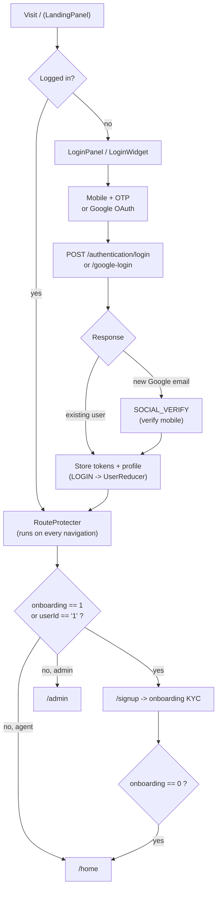

# Login & Onboarding

End-to-end documentation of how a user authenticates and how a new user is onboarded in the WLC web app.

The app is a white-label ("WLC") agent platform. Authentication is **OTP-first** (mobile number + 4-digit SMS OTP) with optional **Google OAuth**. Onboarding is a **config-driven, backend-sequenced** KYC flow shared by three entry points (self, assisted, and embedded gateway) through a single portable `features/onboarding` module.

## Documents in this set

| Doc | What it covers |
|-----|----------------|
| [login.md](./login.md) | Login methods (mobile+OTP, Google), the `LoginWidget` state machine, the new-Gmail mobile-verify path, login API endpoints, response branches |
| [session-tokens.md](./session-tokens.md) | The four tokens, session/local storage layout, token expiry & refresh, logout/revoke, the Android bridge, `useUser()` / `useSession()` |
| [route-protection.md](./route-protection.md) | `RouteProtecter`, the public / public-only / protected model, the onboarding force-redirect, admin vs agent base routes |
| [onboarding.md](./onboarding.md) | The three onboarding flows (Self, Assisted, Gateway), the role-selection + KYC rendering chain, completion tracking |
| [onboarding-configuration.md](./onboarding-configuration.md) | **Developer guide** — step-definition anatomy, config vs custom-coded steps, the runtime step-resolution pipeline, org metadata, URL `role`/`mobile` auto-fill, and recipes to add/edit/delete/reorder steps and add a new user type |

## High-level journey

## Glossary

| Term | Meaning |
|------|---------|
| `access_token` | Full access token; authorizes transactions allowed by the user's assigned roles |
| `access_token_lite` | Light-weight token for regular/high-frequency transactions |
| `access_token_crm` | Token scoped to the CRM API |
| `refresh_token` | Long-lived token used to mint new access tokens; revoked server-side on logout |
| `token_timeout` | Absolute expiry timestamp (ms) computed at **75 %** of the token lifetime — used to refresh proactively |
| `org_id` / `org_token` | Organization identifier and a JWT carrying org details; sent with every auth request |
| `onboarding` | User-profile flag: `1` = onboarding in progress, `0` = complete |
| `applicant_type` | OaaS applicant code sent to the API at role-submit — Retailer `0`, Distributor `2`, Enterprise `3` (`APPLICANT_TYPES`) |
| role id | Sequential id used by the role-selection UI and the `?role` URL param — Retailer `1`, Distributor `2`, Enterprise `3` (`ROLE_IDS`). **Not** the same as `applicant_type` |
| `user_type` | EPS user-type id (e.g. Distributor `1`, Merchant `2`, I-Merchant `3`, Partner `23`); `-1` means "not selected yet" |
| step `role` code | Per-step backend code (e.g. `12400`, `12300`, `24000`) carried in `onboarding_steps` from the API; matched against a step's `applicableRoles` |
| `response_type_id` | Code in an API response; each step validates it against `successResponseTypeIds` |
| `interaction_type_id` | Transaction id (`TransactionIds`) identifying the operation submitted to `/transactions/do` |

## Key-file map

This map is referenced by all docs in this set; individual docs link the specific files relevant to their topic.

| Concern | File |
|---------|------|
| App entry / provider tree | [pages/_app.tsx](/pages/_app.tsx) |
| Landing page | [pages/index.tsx](/pages/index.tsx) → [page-components/LandingPanel/LandingPanel.tsx](/page-components/LandingPanel/LandingPanel.tsx) |
| Login UI | [page-components/LoginPanel/LoginPanel.jsx](/page-components/LoginPanel/LoginPanel.jsx) · [LoginWidget.tsx](/page-components/LoginPanel/LoginWidget/LoginWidget.tsx) · [Login.jsx](/page-components/LoginPanel/Login/Login.jsx) · [VerifyOtp.jsx](/page-components/LoginPanel/VerifyOtp/VerifyOtp.jsx) · [SocialVerify.jsx](/page-components/LoginPanel/SocialVerify/SocialVerify.jsx) |
| Login submit hook | [hooks/useLogin.js](/hooks/useLogin.js) |
| Auth helpers | [helpers/loginHelper.js](/helpers/loginHelper.js) |
| API fetch wrapper | [helpers/apiHelper.js](/helpers/apiHelper.js) |
| User/session state | [contexts/UserContext.js](/contexts/UserContext.js) · [contexts/UserReducer.js](/contexts/UserReducer.js) |
| Route guard | [components/RouteProtecter/RouteProtecter.jsx](/components/RouteProtecter/RouteProtecter.jsx) · [constants/validRoutes.js](/constants/validRoutes.js) |
| Auth endpoints | [constants/EndPoints.js](/constants/EndPoints.js) |
| Onboarding module | [features/onboarding/](/features/onboarding/) |
| Step config | [features/onboarding/constants.ts](/features/onboarding/constants.ts) · [utils/roleSelection.ts](/features/onboarding/utils/roleSelection.ts) |
| Step resolution | [features/onboarding/utils/stepGenerator.ts](/features/onboarding/utils/stepGenerator.ts) |
| Step rendering | [features/onboarding/components/ContentRenderer.tsx](/features/onboarding/components/ContentRenderer.tsx) |
| Step execution | [features/onboarding/utils/executePipeline.ts](/features/onboarding/utils/executePipeline.ts) |
