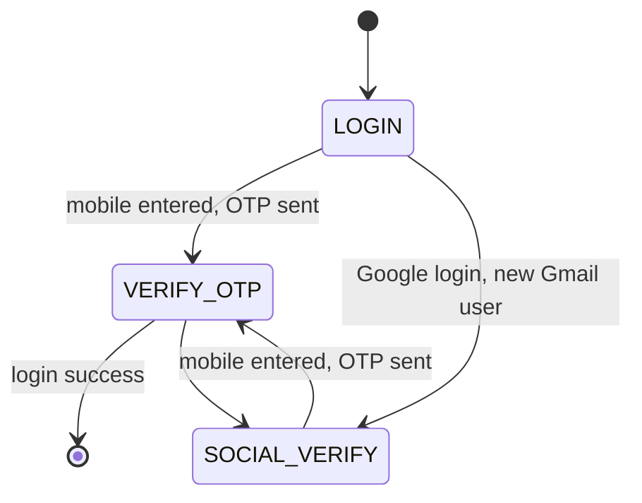
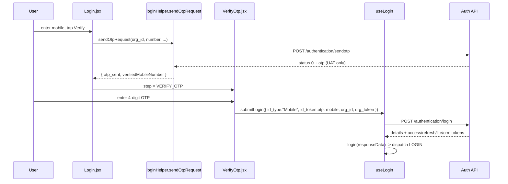
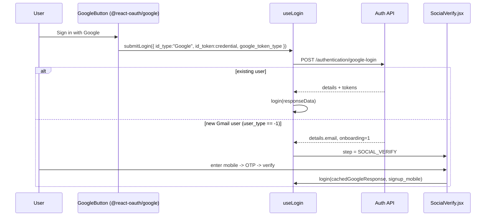

# Login

Two login methods are supported and can be enabled together:

1. **Mobile + OTP** (default) — user enters a mobile number (or a mobile-mapped user id) and verifies a 4-digit OTP sent over SMS.
2. **Google OAuth** — gated by org config `orgDetail.login_types.google`. A brand-new Gmail user must additionally verify a mobile number before onboarding.

All login API paths live in [constants/EndPoints.js](/constants/EndPoints.js).

## Entry points

```
/ (pages/index.tsx)
  └─ LandingPanel  (renders CMS page OR the built-in LoginPanel)
       └─ LoginPanel
            └─ LoginWidget   ← the state machine
```

- [pages/index.tsx](/pages/index.tsx) renders [LandingPanel](/page-components/LandingPanel/LandingPanel.tsx).
- `LandingPanel` reads the URL `?mobile=` query param (`router.query.mobile`, normalized to a string) and passes it down as `initialMobile`. If the org has a CMS landing page (`CMS_LANDING_PAGE` flag + `cms_meta.type === "page"`) it renders that instead of [LoginPanel](/page-components/LoginPanel/LoginPanel.jsx).
- [LoginWidget](/page-components/LoginPanel/LoginWidget/LoginWidget.tsx) is also reused **embedded** inside the onboarding gateway (`mode="embedded"`) — see [onboarding.md](./onboarding.md).

## State machine

`LoginWidget` holds a single `step` state with three values:



- **LOGIN** → [Login.jsx](/page-components/LoginPanel/Login/Login.jsx): mobile/user-id entry + Google button.
- **VERIFY_OTP** → [VerifyOtp.jsx](/page-components/LoginPanel/VerifyOtp/VerifyOtp.jsx): OTP entry + resend (30-second countdown via `ResendOtpSection.jsx`).
- **SOCIAL_VERIFY** → [SocialVerify.jsx](/page-components/LoginPanel/SocialVerify/SocialVerify.jsx): mobile capture for a new Google user.

On mount, [useRestoreLastLoginOrRoute](/page-components/LoginPanel/useRestoreLastLoginOrRoute.ts) pre-fills the last-used number from `localStorage` (`inf-last-login`). When `initialMobile` (from `?mobile=`) is non-empty, that restore is **skipped** so the URL param wins.

`initialMobile` is the prefill source of truth for both the standard login page and the embedded gateway login. See [onboarding-configuration.md](./onboarding-configuration.md#url-parameter-auto-fill) for full `role`/`mobile` auto-fill semantics.

## Mobile + OTP flow



- `sendOtpRequest()` ([loginHelper.js](/helpers/loginHelper.js)) posts to `/authentication/sendotp`. Body: `platform`, `mobile`, `app:"Eloka"`, `org_id`, `org_token`, and `is_mobile_mapped_user_id` when the input is a custom user id. On non-production environments the demo OTP is shown in a toast. Rate-limiting (`response_type_id === 2377`) produces a "try again after N minutes" toast.
- Submit is handled by [useLogin](/hooks/useLogin.js): it posts to `/authentication/login` for `id_type === "Mobile"` (otherwise `/authentication/google-login`), with `platform` injected and a 60-second timeout.

## Google OAuth flow



- [GoogleButton](/page-components/LoginPanel/Login/GoogleButton/GoogleButton.jsx) uses `@react-oauth/google`; it only renders when `orgDetail.login_types.google` is configured.
- In [useLogin](/hooks/useLogin.js), a new Gmail user is detected as `details.user_type === -1 && id_type === "Google" && details.email` → the widget moves to `SOCIAL_VERIFY`, caches the Google response (`setCachedSocialResponse`), and stores the email. After mobile OTP verification the cached response is replayed through `login()` with the verified `signup_mobile`.

## Login response branches

[useLogin](/hooks/useLogin.js) inspects the response and routes accordingly:

| Condition | Result |
|-----------|--------|
| `details` + `access_token` present, role assigned | Success → `login(responseData)` dispatches `LOGIN`; `RouteProtecter` redirects to `/home` or `/admin` |
| `onboarding == 1 && user_type === -1 && id_type === "Google"` | `SOCIAL_VERIFY` (verify mobile, then onboard) |
| `user_type === -1 && id_type === "Google" && email` | `SOCIAL_VERIFY` (new-Gmail signup path) |
| `onboarding == 1 && !details.code` + self-onboarding disabled | Toast "User not found!" → back to `LOGIN` |
| `responseData.otpFailed` | Toast "Wrong OTP. Please try again." (stays on OTP screen) |
| `responseData.accountInactive` | Toast "Your account has been temporarily blocked." → `LOGIN` |
| no `access_token`, none of the above | Toast "Login failed." → `LOGIN` |

Self-onboarding is considered disabled when `orgDetail.metadata.disable_self_onboarding.value` is true **or** env `NEXT_PUBLIC_DISABLE_SELF_ONBOARDING` is set.

A successful mobile/Google login that returns `onboarding == 1` lands the user in the onboarding flow — see [onboarding.md](./onboarding.md). What happens to the tokens after `LOGIN` is dispatched is covered in [session-tokens.md](./session-tokens.md).

## Login API endpoints

| Endpoint (constant) | Path | Purpose |
|---------------------|------|---------|
| `SENDOTP` | `POST /authentication/sendotp` | Send/resend OTP |
| `LOGIN` | `POST /authentication/login` | Mobile + OTP login |
| `GOOGLELOGIN` | `POST /authentication/google-login` | Google OAuth login |
| `REFRESH_PROFILE` | `POST /authentication/refresh-profile` | Fetch fresh profile (also used heavily during onboarding) |

`org_id` and `org_token` come from the org config; `platform` is `"android"` inside the Android wrapper, else `"web"`.
