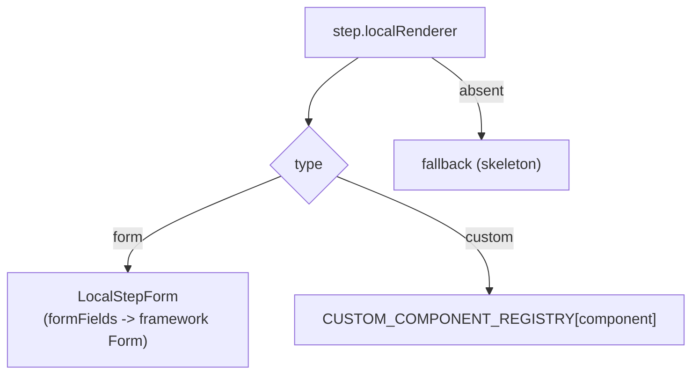
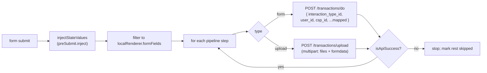
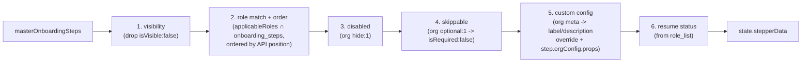

# Onboarding — Configuration & Extension Guide

This is the developer guide for the onboarding engine: how a step is defined, what is plain configuration vs custom React code, how the backend decides which step a user sees next, and concrete recipes for changing the flow.

The onboarding flow is **customizable per user type** (out of the box: Retailer and Distributor). Steps are declared once in a master list, mapped to user types via per-step role codes, and then **filtered and ordered at runtime by signals from the backend**. Most of what an org sees is configuration; only a handful of steps need bespoke React components.

## Where configuration lives

| Concern | File |
|---------|------|
| Master step list + types + id/response constants | [features/onboarding/constants.ts](/features/onboarding/constants.ts) |
| Role-selection config (roles, visibility, `?role`) | [features/onboarding/utils/roleSelection.ts](/features/onboarding/utils/roleSelection.ts) |
| Runtime step resolution pipeline | [features/onboarding/utils/stepGenerator.ts](/features/onboarding/utils/stepGenerator.ts) |
| Form vs custom rendering + custom registry | [features/onboarding/components/ContentRenderer.tsx](/features/onboarding/components/ContentRenderer.tsx) |
| API pipeline executor | [features/onboarding/utils/executePipeline.ts](/features/onboarding/utils/executePipeline.ts) |
| Module ↔ host boundary (services) | [features/onboarding/contracts.ts](/features/onboarding/contracts.ts) |
| `?role` parsing | [features/onboarding/components/OnboardingWidget.tsx](/features/onboarding/components/OnboardingWidget.tsx) |
| `?bv` (business vertical) code map + parser | [features/onboarding/constants.ts](/features/onboarding/constants.ts) (`BUSINESS_VERTICAL_BY_CODE`, `parseBusinessVertical`) |
| `?mobile` prefill | [page-components/LandingPanel/LandingPanel.tsx](/page-components/LandingPanel/LandingPanel.tsx) |

## Step-definition anatomy

Every KYC step is one object in `masterOnboardingSteps` ([constants.ts](/features/onboarding/constants.ts)), typed as `OnboardingStep`. Annotated example (Aadhaar verification — a form that uploads two files):

```ts
{
  id: ONBOARDING_STEP_IDS.AADHAAR_VERIFICATION, // stable step id (also used by handlers)
  name: "AADHAAR_VERIFICATION",                 // internal key (also an org-metadata stepKey)
  label: "Aadhaar Verification",                // default label; API may override per-user
  isRequired: true,                             // gate completion (org `optional` can relax)
  isVisible: true,                              // false => never rendered (hard filter)
  stepStatus: 0,                                // runtime status, set by resume logic
  applicableRoles: [12400],                     // backend role codes this step maps to
  primaryCTAText: "Verify Aadhaar",
  description: "Upload clear photos ...",
  form_data: {},

  // --- HOW it renders -------------------------------------------------
  localRenderer: {
    type: "form",                               // "form" => LocalStepForm; "custom" => component
    formFields: [                               // parameter_list rendered by the framework Form
      { name: "aadhaar_front_image", label: "Aadhaar Front Image",
        parameter_type_id: ParamType.FILE, required: true,
        meta: { accept: "image/jpeg,image/png" } },
      { name: "aadhaar_back_image",  label: "Aadhaar Back Image",
        parameter_type_id: ParamType.FILE, required: true,
        meta: { accept: "image/jpeg,image/png" } },
    ],
  },

  // --- WHAT it submits ------------------------------------------------
  api: {
    pipeline: [
      { id: "upload", type: "upload", docType: 1,
        interactionTypeId: TransactionIds.UPLOAD_DOCUMENT,
        fieldMapping: { aadhaar_front_image: "file1", aadhaar_back_image: "file2" },
        successResponseTypeIds: [RESPONSE_TYPE_IDS.AADHAAR_VERIFICATION] },
    ],
  },

  // --- side effects / data plumbing ----------------------------------
  preSubmit: { inject: { latlong: "state.latLong" } },  // pull from shared state pre-submit
  postSubmit: { refreshProfile: true },                 // re-fetch profile after success
  onPreSubmit: (data, actions) => { /* save form values into state */ },
  callbacks: { type: "esign", methods: [...] },          // third-party integration hooks
}
```

### When a step refreshes the profile

`postSubmit.refreshProfile` governs one thing only — whether the profile is re-fetched
(`POST /authentication/refresh-profile`) **after** a step submits successfully. It does not
affect the step's API pipeline, validation, or visibility.

- **Effectively all steps set `true`.** Refreshing after each success keeps the rendered
  `stepperData` resume state and the `onboarding` completion flag in sync with the backend.
- **`LOCATION_CAPTURE` is the sole `false`.** Refreshing after it is unnecessary — it does
  not change onboarding status — and skips a wasteful round-trip. It still has a full API
  pipeline and `applicableRoles`; only the post-submit re-fetch is suppressed.
- **Compound steps refresh once for the whole step.** `VIDEO_KYC`, for example, submits a
  location transaction *and* a selfie upload yet still refreshes, because the enclosing step
  is `true`. A location *submission* inside another step is unrelated to `LOCATION_CAPTURE`.
- **Safety net — the last step always refreshes.** Independent of the flag,
  `advanceToNextStep` ([OnboardingContext.tsx](/features/onboarding/context/OnboardingContext.tsx))
  forces a refresh when the completed step is the last incomplete applicable one (`nextStep`
  is `undefined`). A mis-set `refreshProfile: false` on the terminal step therefore can
  never strand the user — the completion flag is always observed. (If `LOCATION_CAPTURE`
  happens to be the last remaining step, it too refreshes for this reason.)

Supporting constants in the same file:

| Constant | Use |
|----------|-----|
| `ONBOARDING_STEP_IDS` | Stable numeric ids per step (`WELCOME`, `SELECTION_SCREEN`, `LOCATION_CAPTURE`, …) |
| `RESPONSE_TYPE_IDS` | Per-step success codes checked against the API `response_type_id` |
| `ONBOARDING_STEP_STATUS` | `NOT_STARTED 0`, `IN_PROGRESS 1`, `COMPLETED 2`, `FAILED 3`, `SKIPPED 4` |
| `APPLICANT_TYPES` | OaaS applicant codes submitted at role selection — Retailer `0`, Distributor `2`, Enterprise `3` |

`applicableRoles` values (e.g. `12400`, `12300`, `13000`, `24000`, `12500`, `13300`, `51700`, `12600`, `12800`) are **backend "role" codes** delivered per user in the API `onboarding_steps` array — not `applicant_type` and not EPS `user_type`. A step is included for a user when any of its `applicableRoles` appears in that user's `onboarding_steps`.

### `ApiPipelineStep` fields

| Field | Meaning |
|-------|---------|
| `id` | Pipeline-local id (e.g. `"submit"`, `"upload"`, `"verify"`) |
| `type` | `"form"` → `/transactions/do`; `"upload"` → `/transactions/upload` |
| `interactionTypeId` | `TransactionIds.*` operation id |
| `docType` | Document type id for uploads |
| `fieldMapping` | Rename form fields → API params / file keys (`file1`, `file2`, …) |
| `successResponseTypeIds` | Response ids that count as success (**default `[0]`**) |
| `checkInvalidParams` | If true (**default**), a non-empty `invalid_params` fails the call |

## User-type numbering schemes

"What kind of user" appears in **two submitted schemes plus one backend-native scheme** that are easily confused. They are not interchangeable — values deliberately collide (e.g. a Distributor is `applicant_type 2` but EPS `user_type 1`), which is exactly why an explicit mapping exists.

| Role | role id (UI / `?role`) | `applicant_type` (OaaS, submitted) | EPS `user_type` (backend identity) |
|------|------|------|------|
| Retailer | `1` | `0` | `2` (MERCHANT) |
| Distributor | `2` | `2` | `1` (DISTRIBUTOR) |
| Enterprise | `3` | `1` | `23` (ENTERPRISE_PARTNER_ADMIN) |

| Scheme | What it is | Where defined |
|--------|-----------|---------------|
| **role id** | Sequential id used by the role-selection UI and the `?role` URL param (filters which role cards show) | `ROLE_IDS` — [roleSelection.ts](/features/onboarding/utils/roleSelection.ts) |
| **`applicant_type`** | OaaS (onboarding widget) applicant code; carried on each role card and **submitted** at role selection | `APPLICANT_TYPES` — [constants.ts](/features/onboarding/constants.ts); assigned per role in `getBaseRoleData()` ([roleSelection.ts](/features/onboarding/utils/roleSelection.ts)) |
| **EPS `user_type`** | The backend's canonical user-type id. **Read from the profile** (`userDetails.user_type`), never submitted from here. Keys the org-metadata config and the shared label/icon constants | values: `UserType` / `UserTypeLabel` / `UserTypeIcon` — [constants/UserTypes.js](/constants/UserTypes.js) |

> **Note on `merchant_type`.** Earlier code also submitted a `merchant_type` field (the EPS `user_type`, derived via `APPLICANT_TO_USER_TYPE`) alongside `applicant_type`. That field is **no longer required by the APIs and has been removed** from all submissions (role selection, assisted add-agent, assisted OTP). The EPS `user_type` numbering itself remains — but only as a **backend-read** identity (profile + org-config + icons), not as a submitted parameter.

**What is submitted now:** `submitRoleSelection()` ([RoleSelection.tsx](/features/onboarding/components/RoleSelection.tsx)) sends `applicant_type` (+ `csp_id`), plus `business_vertical` **only when** the `?bv` query param resolved to a known vertical (see [`?bv`](#bv--business-vertical) below), in the `CREATE_PARTIAL_ACCOUNT` transaction (`/transactions/do`):

```js
form_data: {
  applicant_type: applicantType,   // OaaS code (0/2/3)
  csp_id: mobile,
  business_vertical: "SBI Kiosk",  // optional — omitted when ?bv is absent/unknown
}
```

The `APPLICANT_TO_USER_TYPE` map is **still used** — but only to drive the role-card icon (`getIconForApplicantType` → `UserTypeIcon`), not to submit anything.

> When extending the flow, keep the schemes straight: `?role` and `visibleAgentTypes` use **role id**; what gets submitted at role selection is `applicant_type` only; the EPS `user_type` is backend-read (org-config keys + icons/labels); step filtering (`applicableRoles`) uses the separate **backend role codes** described above.

## Config-driven vs custom-coded

[ContentRenderer](/features/onboarding/components/ContentRenderer.tsx) decides how the current step renders from `localRenderer.type`:



| Concern | Pure configuration | Needs custom React code |
|---------|--------------------|-------------------------|
| Simple field capture (text, file, select) | ✅ `localRenderer.type: "form"` + `formFields` | — |
| API call(s) for a step | ✅ `api.pipeline[]` | — |
| Per-org enable/disable/optional | ✅ org metadata (below) | — |
| Per-org label / description override on a step | ✅ org metadata `meta.label` / `meta.description` (override the step's native fields) | — |
| Per-org component behavior flag (e.g. hide a field) | ✅ org metadata `meta.props` (component reads `stepConfig.orgConfig.props`) | component must whitelist the key |
| Bespoke UI / device or 3rd-party SDK interaction | — | ✅ `localRenderer.type: "custom"` + a component |

Custom steps are looked up by name in `CUSTOM_COMPONENT_REGISTRY`. Currently registered:

`AddBankAccountStep`, `BusinessDetailsStep`, `DigilockerRedirectionStep`, `SecretPinStep`, `SignAgreementStep`, `VideoKycStep` (all under [features/onboarding/components/custom/](/features/onboarding/components/custom/)).

Components receive `CustomComponentProps` (`stepConfig`, `onSubmit`, `onAdvance`, `onSkip`, `isLoading`, `additionalData`). New ones can be added to the static registry, or registered at runtime with `registerCustomComponent(name, component)`. Integration logic (e.g. e-sign providers) lives under [features/onboarding/services/](/features/onboarding/services/) — for example the e-sign service with Karza / Leegality / Signzy providers.

## Pipeline execution

`executePipeline()` ([executePipeline.ts](/features/onboarding/utils/executePipeline.ts)) runs a step's `api.pipeline` **sequentially, stop-on-first-failure**, with smart retry (a retry resumes from the first non-success call):



- **Form call** (`executeFormCall`) posts JSON to `/transactions/do` with `interaction_type_id`, `user_id = mobile`, `csp_id = mobile`, plus the mapped form fields; the shared `fetcher` carries the token and the refresh callback.
- **Upload call** (`executeUploadCall`) uses a raw `fetch` to `/transactions/upload`, appending files under their mapped keys plus a URL-encoded `formdata` field (`intent_id: 3`, `doc_type`, `latlong`, `source: "WLC"`, `user_id`, `csp_id`). On 401 it calls `generateNewToken(true)`.
- **Success test** (`isApiSuccess`): `response.response_type_id` (or `response.status`) ∈ `successResponseTypeIds` **and** no `invalid_params` (when `checkInvalidParams`).
- **`preSubmit.inject`** maps a target field to a dot-path in shared state (e.g. `latlong: "state.latLong"`); the leading `state.` is stripped during lookup.

## Runtime step resolution — "which step is next?"

The frontend never hard-codes a per-user sequence. The backend drives it through `POST /authentication/refresh-profile`, whose `details` carry:

- `onboarding_steps`: an ordered array of `{ role, label }` — the steps (by role code) this user must complete, **in the order the backend wants them**.
- `role_list`: the **pending** role codes (what's still left), used to compute resume status.
- `onboarding`: the `1`/`0` completion flag.

`generateInitialSteps()` ([stepGenerator.ts](/features/onboarding/utils/stepGenerator.ts)) turns the master list + these signals into the rendered step list via a 5-stage pure pipeline:



1. **Visibility** — removes any step with `isVisible: false`.
2. **Role match + order** (`filterOnboardingStepsByRoles`) — keeps steps whose `applicableRoles` intersect the API `onboarding_steps` roles, **orders them by the API's position** (not the master-list order), and overrides each `label` with the API-provided label when present.
3. **Disabled** (`filterDisabledStepsHelper`) — drops steps an org turned off (`hide: 1`).
4. **Skippable** (`applySkippableStepsHelper`) — marks org-optional steps `isRequired: false`.
5. **Custom config** (`applyStepOrgConfigHelper`) — overrides `step.label` / `step.description` from org metadata `meta` (a non-empty string only) and attaches `step.orgConfig = { props }`. Runs before resume so the cloning resume stage preserves it.
6. **Resume** (`calculateResumeState`) — using `role_list` (pending roles), marks steps before the first pending one `COMPLETED`, the first pending one `IN_PROGRESS`, and the rest `NOT_STARTED`.

This runs once when user data loads (via `OnboardingProvider.initializeSteps`) and the result is stored in `state.stepperData`.

## Org-metadata configuration

Per-org overrides come from `orgDetail.metadata.onboarding` (passed in as `orgMetadataOnboarding`). Shape:

```
metadata.onboarding[userType][stepKey] = {
  hide: 0|1,
  optional: 0|1,
  meta: {
    reason,        // developer note — logged only
    label,         // overrides the step's native label (title + stepper)
    description,   // overrides the step's native description (under the title)
    props,         // generic flag bag forwarded to the step component
  },
}
```

### Role-selection visibility (top-level keys)

Role selection runs **before** any user type is known, so the levers that control which role cards show sit as **top-level siblings** of the per-userType keys (not under `[userType]`). Both are read in [OnboardingWidget.tsx](/features/onboarding/components/OnboardingWidget.tsx) and folded into `allowedRoleIds` via `resolveAllowedRoleIds` ([roleSelection.ts](/features/onboarding/utils/roleSelection.ts)):

```
metadata.onboarding.allowedRoleIds = [3]      // exact visible set — [3] = Enterprise only
metadata.onboarding.showEnterprise = true     // shorthand: default set + Enterprise → [1,2,3]
```

- **`allowedRoleIds: number[]`** — the org fully controls the visible set (role ids: `1` Retailer, `2` Distributor, `3` Enterprise). `[3]` hides Retailer + Distributor; `[1,3]` shows Retailer + Enterprise. Empty/non-array/non-numeric → ignored.
- **`showEnterprise: true | 1`** — back-compat shorthand that appends Enterprise to the default `selfOnboarding` set. Accepts boolean `true` or numeric `1` (repo's `hide:1`/`optional:1` convention); a stray `"false"` string is rejected.
- **Precedence** (first match wins): `?role=` > `?bv=` > `allowedRoleIds` > `showEnterprise` > hardcoded `visibleAgentTypes.selfOnboarding`. URL deep-links always override org config. Assisted onboarding is unaffected (always `visibleAgentTypes.assistedOnboarding`).

This lets an org tweak the flow **per user type** without code changes — keyed first by the (normalized) **EPS `user_type`** read from the profile (see [User-type numbering schemes](#user-type-numbering-schemes)), then by step. This key is the backend identity — **not** the removed `merchant_type` submit param — so it is entirely unaffected by that removal. Concrete example:

```json
{
  "metadata": {
    "onboarding": {
      "2": {                              // Retailer/Merchant (type 3 normalizes to 2)
        "VIDEO_KYC": {                    // Step name
          "hide": 1,
          "meta": {
            "reason": "Video KYC not required for this partner"
          }
        },
        "ADD_BANK_ACCONT": {
          "optional": 1,
          "meta": {
            "reason": "Bank details can be added later",              // dev log only
            "description": "Bank account is needed for settlement.",  // overrides step description
            "props": { "hidePassbook": true }                         // flags for the component
          }
        }
      },
      "1": {                              // Distributor
        "AADHAAR_VERIFICATION": { "hide": 1 }
      }
    }
  }
}
```

Result for this org: Retailers skip Video KYC entirely and may skip the bank-account step; Distributors skip Aadhaar verification. Every other org keeps the default flow.

`extractStepConfiguration()` ([stepGenerator.ts](/features/onboarding/utils/stepGenerator.ts)) reads it:

- `userType` is **normalized** (`3 → 2`) before lookup — config under key `"2"` also applies to type-3 users.
- `stepKey` is matched to a step by **name or id** via `createStepLookupMap` (so `"VIDEO_KYC"` or `"11"` both resolve to the same step).
- `hide: 1` disables the step (takes precedence); `optional: 1` marks it skippable (`isRequired: false`). The optional `meta.reason` is logged.
- `meta.label`, `meta.description` and `meta.props` are collected **independently** of `hide`/`optional` (a step can carry them while neither hidden nor optional). `label`/`description` **override** the step's top-level `label`/`description` (applied only when a non-empty string, so a malformed config can't blank a title); `props` is attached as `step.orgConfig = { props }`. Because these ride the top-level fields (and `stepConfig` prop), they reach every renderer + the stepper with no extra wiring.
- These feed stages 3 (disabled), 4 (skippable) and **5 (custom-config merge)** of the [resolution pipeline](#runtime-step-resolution--which-step-is-next) above. Note org config can only **hide/relax/annotate** steps the backend already returned in `onboarding_steps` — it cannot add a step the backend didn't send.

### Overriding label / description & passing props to a step

Two channels ride on `meta`:

- **`meta.label` / `meta.description`** — **override** the step's native `label` and `description`. They replace the top-level `step.label` / `step.description`, so every renderer (form + all custom steps) **and** the stepper progress header pick them up with no per-component code. Applied only when a non-empty string (a blank/whitespace value is ignored, so a malformed config can't wipe a title). **Precedence:** `meta.label` wins over the backend API label (`onboarding_steps[].label`) — the org merge runs after the API-label stage. There is no separate callout banner; the old `meta.instruction` channel has been removed in favour of these overrides.
- **`meta.props`** — a generic `Record<string, unknown>` flag bag surfaced via `step.orgConfig.props`. The channel is generic; **each component owns and whitelists the keys it reads** (`stepConfig.orgConfig?.props`). `AddBankAccountStep` currently supports:

  | prop | effect |
  |------|--------|
  | `hidePassbook: true` | removes the passbook upload field entirely; its upload pipeline step is skipped (the bank `upload` step sets `skipIfNoFiles: true`, so a fileless submit is a success, not a failure) |
  | `passbookOptional: true` | keeps the passbook field but `required: false` |

  **Generic form-step props (read by `LocalStepForm`).** Every `localRenderer.type: "form"`
  step is rendered by the shared `LocalStepForm`, which whitelists two generic keys and
  matches them against field `name` — the form-step analog of the custom bank flags above:

  | prop | effect |
  |------|--------|
  | `hideFields: string[]` | drops those fields from the rendered form; a hidden field captures no value, so nothing is submitted for it |
  | `optionalFields: string[]` | sets `required: false` on those fields — **only** `required`; other validations (e.g. `pattern`, `minLength`) still apply |

  > ⚠️ Hiding a field whose value the pipeline/API still expects can submit **incomplete
  > data** — field hiding must match pipeline/API expectations. Example: the PAN step's
  > number `doc_id` is submitted inside the *same* upload call as the image, so
  > `hideFields: ["pan_image"]` sends a **number-only PAN** (no `file1`); the backend must
  > accept that for docType 2. There is no separate form step, so `skipIfNoFiles` must
  > **not** be added to PAN (it would skip the call and drop `doc_id`).

  Example — an org that captures the PAN number but not the PAN card image:

  ```json
  {
    "metadata": {
      "onboarding": {
        "2": {
          "PAN_VERIFICATION": {
            "meta": {
              "description": "Enter your PAN number to continue.",
              "props": { "hideFields": ["pan_image"] }
            }
          }
        }
      }
    }
  }
  ```

Example — Retailers get an org-specific description and skip the passbook upload, but still capture account details:

```json
{
  "metadata": {
    "onboarding": {
      "2": {
        "ADD_BANK_ACCONT": {
          "meta": {
            "description": "Add your bank account so we can send your payouts.",
            "props": { "hidePassbook": true }
          }
        }
      }
    }
  }
}
```

To support a new flag on a component, read the key off `stepConfig.orgConfig?.props` inside that component (narrow to the expected type, e.g. `=== true`) — no type or pipeline change is required.

## URL parameter auto-fill

Three query params let a partner deep-link into a pre-filled flow.

### `?role` — pre-select / restrict the user type

- Parsed in [OnboardingWidget.tsx](/features/onboarding/components/OnboardingWidget.tsx) (guarded on `router.isReady`) into `allowedRoleIds: number[]` of **role ids** (`1` Retailer, `2` Distributor, `3` Enterprise). `?role=1,2` or duplicated `?role=1&role=2` both work. The parser only drops non-numeric tokens (`isNaN`); empty/absent or all-non-numeric input → `undefined` (falls back to defaults). Note: numeric-but-unknown ids (e.g. `?role=999`) are **not** filtered out — they pass through and simply match no role card, so the role list comes back empty rather than falling back.
- Passed to [RoleSelection](/features/onboarding/components/RoleSelection.tsx) as `allowedRoleIds`, which sets the visible roles:
  `forAgentTypes = isAssistedOnboarding ? visibleAgentTypes.assistedOnboarding : (allowedRoleIds || visibleAgentTypes.selfOnboarding)`.
- It **filters** which role cards show; it does not blindly auto-select. **Auto-submit only happens when exactly one role remains** (`roles.length === 1`). When `allowedRoleIds` is `undefined` (empty/non-numeric param) it falls back to org config then the normal `visibleAgentTypes.selfOnboarding` choices — full precedence: `?role=` > `?bv=` > org `allowedRoleIds` > org `showEnterprise` > `selfOnboarding` (see [Role-selection visibility](#role-selection-visibility-top-level-keys)).
- `RouteProtecter` preserves `?role` when it force-redirects to `/signup`, so the param survives the login→onboarding hop. See [route-protection.md](./route-protection.md).

### `?bv` — business vertical

- Declares which business line the signup belongs to. **Public param, so the URL uses clean lowercase codes**, not the raw backend strings (which contain spaces, e.g. `"SBI Kiosk"`):

  | `?bv` code | Submitted `business_vertical` |
  |-----------|-------------------------------|
  | `eps` | `EPS` |
  | `eloka` | `Eloka` |
  | `sbi_kiosk` | `SBI Kiosk` |
  | `enterprise` | `Enterprise` |

- Parsed in [OnboardingWidget.tsx](/features/onboarding/components/OnboardingWidget.tsx) (guarded on `router.isReady`) via `parseBusinessVertical` ([constants.ts](/features/onboarding/constants.ts)), then passed to [RoleSelection](/features/onboarding/components/RoleSelection.tsx) as `businessVertical`. It rides on the **same entry URLs as `?role`** (`/signup`, `/gateway/onboarding`).
- **Strict mapping** = whitelist validation: the value is `trim`+`lowercase`d and looked up in `BUSINESS_VERTICAL_BY_CODE`. Unknown / empty / missing codes resolve to `undefined`, and `business_vertical` is then **omitted** from the role-selection submission entirely. A duplicated `?bv=a&bv=b` arrives as an array — **first value wins** (same normalization as `?mobile`).
- Submitted by `submitRoleSelection()` as `business_vertical` in the `CREATE_PARTIAL_ACCOUNT` payload (see [User-type numbering schemes](#user-type-numbering-schemes)). Unlike `?role` it does not filter role cards — it only annotates the submission.

### `?mobile` — pre-fill the number

- Read in [LandingPanel.tsx](/page-components/LandingPanel/LandingPanel.tsx) (`router.query.mobile`, array-normalized) → **sanitized** by the local `sanitizeMobile` to a bare 10-digit string (strips non-digits and any `+91`/`91`/leading-`0` prefix via "keep last 10 digits"; empty → `undefined`) → passed to `LoginPanel` → `LoginWidget` as `initialMobile`. A non-empty `initialMobile` makes [useRestoreLastLoginOrRoute](/page-components/LoginPanel/useRestoreLastLoginOrRoute.ts) skip the cached number, so the URL wins.
- In the embedded gateway, `GatewayWidget` forwards `?mobile` to `OnboardingGateway` (`passMobile: true`), which feeds it into the embedded `LoginWidget` as `initialMobile`.
- The standard login page and the gateway login read `?mobile`; the admin assisted pages do **not** consume `?mobile`.

## Portable module / services boundary

The onboarding module is host-agnostic. The host injects everything environment-specific through an `OnboardingServices` object ([contracts.ts](/features/onboarding/contracts.ts)):

```ts
interface OnboardingServices {
  accessToken: string;                       // token used for all step API calls
  generateNewToken: (logoutOnFailure?) => boolean; // refresh callback
  isAndroid?: boolean;                       // running in the Android WebView?
  pubsub?: { publish, subscribe, TOPICS };   // optional cross-component messaging
}
```

Internal components read it via `useOnboardingContext().services`. This boundary is why the **same** `OnboardingWidget` powers all three flows with different tokens: Self passes the logged-in user's token, Assisted passes the admin's, and Gateway passes `agentServices` (the agent's own `access_token`). See [onboarding.md](./onboarding.md).

## Recipes

### 1. Add a form step (config only)

1. Add an id to `ONBOARDING_STEP_IDS` and a success code to `RESPONSE_TYPE_IDS` in [constants.ts](/features/onboarding/constants.ts).
2. Append an `OnboardingStep` to `masterOnboardingSteps`: set `applicableRoles` (the backend role code(s) for the user types that need it), `localRenderer.type: "form"` with `formFields`, and an `api.pipeline` with the right `interactionTypeId` and `successResponseTypeIds`.
3. Ensure the backend includes the step's role in the user's `onboarding_steps` (the step won't appear otherwise — resolution is backend-gated).

### 2. Add a custom-UI step

1. Create the component under [components/custom/](/features/onboarding/components/custom/) implementing `CustomComponentProps`.
2. Register it: add it to `CUSTOM_COMPONENT_REGISTRY` in [ContentRenderer.tsx](/features/onboarding/components/ContentRenderer.tsx) (or call `registerCustomComponent("MyStep", MyStep)`).
3. Add the step to `masterOnboardingSteps` with `localRenderer: { type: "custom", component: "MyStep" }` plus its `api.pipeline`.

### 3. Edit a step

Change `formFields` / validations / `description` / `primaryCTAText`, or the pipeline `fieldMapping` / `interactionTypeId`, in the step's object. To change a label/description per-user, supply the label from the backend (`onboarding_steps[].label` overrides the static `label`). To change them **per-org/per-user-type**, set `metadata.onboarding[userType][stepKey].meta.label` / `meta.description` — the org value overrides both the static default and the backend API label (see Recipe 7).

### 4. Delete or disable a step

- Permanently: remove it from `masterOnboardingSteps` (or set `isVisible: false` to hard-hide everywhere).
- Per-org: set `metadata.onboarding[userType][stepKey].hide = 1`.
- Make it skippable (not removed): `metadata.onboarding[userType][stepKey].optional = 1`.

### 5. Reorder steps

Step order is **API-driven** — `generateInitialSteps` orders by each step's position in `onboarding_steps`, deliberately ignoring master-list order to stay in sync with backend status. To change the sequence, change the order the backend returns in `onboarding_steps`; reordering `masterOnboardingSteps` alone has no effect on rendered order.

### 6. Add onboarding for a new user type

This spans config in several places, not just `applicableRoles`:

1. **Role selection** ([roleSelection.ts](/features/onboarding/utils/roleSelection.ts)): add an entry to `ROLE_IDS`, extend `getBaseRoleData()` (label, icon, `applicant_type`), and add the role id to the relevant `visibleAgentTypes` list (`selfOnboarding` / `assistedOnboarding`).
2. **Applicant → user-type mapping**: extend `APPLICANT_TYPES` ([constants.ts](/features/onboarding/constants.ts)) and `APPLICANT_TO_USER_TYPE` ([RoleSelection.tsx](/features/onboarding/components/RoleSelection.tsx)) so the correct role-card icon resolves (this map is icon-only now that `merchant_type` is no longer submitted). The org-metadata config for the new type is keyed by its **EPS `user_type`**.
3. **Labels**: ensure the user-type label exists (`UserTypeLabel` / `useUserTypes`) so role cards read correctly.
4. **Steps**: add the new type's role code(s) to the `applicableRoles` of every step it should see.
5. **Backend**: have the API return the new type's steps (and their order/labels) in `onboarding_steps`, and pending roles in `role_list`.
6. **Org metadata** (optional): add a block under the new (normalized) `userType` key to hide/relax steps for that type.

### 7. Override a step's label/description or pass a custom flag (config only)

No code change for label/description; a one-line read for a new flag.

1. **Label / description**: set `metadata.onboarding[userType][stepKey].meta.label = "…"` and/or `meta.description = "…"`. They override the step's native fields everywhere (title, body, stepper) for that org + user type, winning over the backend API label. A blank/whitespace value is ignored.
2. **Existing flags**:
   - Custom bank step: `meta.props.hidePassbook = true` or `meta.props.passbookOptional = true`.
   - Any `type: "form"` step (via `LocalStepForm`): `meta.props.hideFields = ["<fieldName>"]` to drop a field, or `meta.props.optionalFields = ["<fieldName>"]` to relax its `required`. E.g. hide the PAN card image with `"hideFields": ["pan_image"]`. Ensure the pipeline/API still accepts the reduced submission (see the ⚠️ note above).
3. **New flag for a component**: add `meta.props.<yourFlag>` in config, then in the target component read `stepConfig.orgConfig?.props?.<yourFlag>` (narrow the `unknown`, e.g. `=== true`). The component owns/whitelists its keys; the channel itself needs no type change. For a flag that should also drop an upload pipeline step, set `skipIfNoFiles: true` on that `upload` step so an empty submit is skipped, not failed — **but only when the essential data is submitted by a *different* pipeline step** (as with the bank `verify` form step); do not use it where the same call also carries required non-file fields.

### 8. Add a new filter stage or step-metadata field

[stepGenerator.ts](/features/onboarding/utils/stepGenerator.ts) documents its own extension points in the file header:

- **New filter stage**: write a pure `(steps, ...args) => steps` function, insert it at the right position inside `generateInitialSteps`, thread any new args through, and pass them from `OnboardingProvider.initializeSteps`.
- **New metadata field**: add it to the `OnboardingStep` type in [constants.ts](/features/onboarding/constants.ts), set it on the relevant steps, and (if it drives runtime behavior) add a filter/transform stage that reads it.

### 9. Restrict which role cards show at role selection, per org (config only)

No code change. Set a **top-level** key on `metadata.onboarding` (sibling of the `[userType]` keys — role selection runs before a user type exists):

- **Exact set**: `metadata.onboarding.allowedRoleIds = [3]` → only Enterprise (hides Retailer + Distributor). `[1,3]` → Retailer + Enterprise. Role ids: `1` Retailer, `2` Distributor, `3` Enterprise.
- **Just add Enterprise**: `metadata.onboarding.showEnterprise = true` (or `1`) → default `selfOnboarding` set plus Enterprise (`[1,2,3]`).

URL params still override: `?role=` > `?bv=` > `allowedRoleIds` > `showEnterprise` > `selfOnboarding` default. If the resulting set is a single role, role selection auto-submits. See [Role-selection visibility](#role-selection-visibility-top-level-keys).
