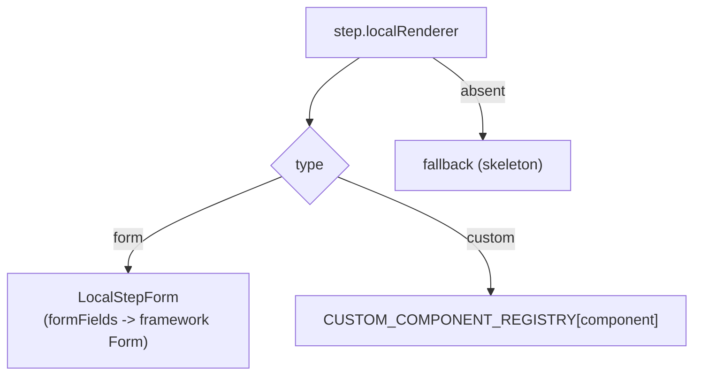
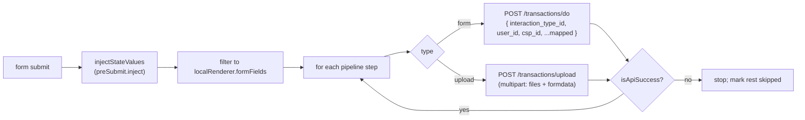
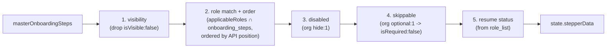

# Onboarding — Configuration & Extension Guide

This is the developer guide for the onboarding engine: how a step is defined, what is plain configuration vs custom React code, how the backend decides which step a user sees next, and concrete recipes for changing the flow.

The onboarding flow is **customizable per user type** (out of the box: Retailer and Distributor). Steps are declared once in a master list, mapped to user types via per-step role codes, and then **filtered and ordered at runtime by signals from the backend**. Most of what an org sees is configuration; only a handful of steps need bespoke React components.

## Where configuration lives

| Concern | File |
|---------|------|
| Master step list + types + id/response constants | [features/onboarding/constants.ts](/features/onboarding/constants.ts) |
| Role-selection config (roles, visibility, `?role`) | [features/onboarding/utils/roleSelection.ts](/features/onboarding/utils/roleSelection.ts) |
| Runtime step resolution pipeline | [features/onboarding/utils/stepGenerator.ts](/features/onboarding/utils/stepGenerator.ts) |
| Form vs custom rendering + custom registry | [features/onboarding/components/ContentRenderer.tsx](/features/onboarding/components/ContentRenderer.tsx) |
| API pipeline executor | [features/onboarding/utils/executePipeline.ts](/features/onboarding/utils/executePipeline.ts) |
| Module ↔ host boundary (services) | [features/onboarding/contracts.ts](/features/onboarding/contracts.ts) |
| `?role` parsing | [features/onboarding/components/OnboardingWidget.tsx](/features/onboarding/components/OnboardingWidget.tsx) |
| `?mobile` prefill | [page-components/LandingPanel/LandingPanel.tsx](/page-components/LandingPanel/LandingPanel.tsx) |

## Step-definition anatomy

Every KYC step is one object in `masterOnboardingSteps` ([constants.ts](/features/onboarding/constants.ts)), typed as `OnboardingStep`. Annotated example (Aadhaar verification — a form that uploads two files):

```ts
{
  id: ONBOARDING_STEP_IDS.AADHAAR_VERIFICATION, // stable step id (also used by handlers)
  name: "AADHAAR_VERIFICATION",                 // internal key (also an org-metadata stepKey)
  label: "Aadhaar Verification",                // default label; API may override per-user
  isRequired: true,                             // gate completion (org `optional` can relax)
  isVisible: true,                              // false => never rendered (hard filter)
  stepStatus: 0,                                // runtime status, set by resume logic
  applicableRoles: [12400],                     // backend role codes this step maps to
  primaryCTAText: "Verify Aadhaar",
  description: "Upload clear photos ...",
  form_data: {},

  // --- HOW it renders -------------------------------------------------
  localRenderer: {
    type: "form",                               // "form" => LocalStepForm; "custom" => component
    formFields: [                               // parameter_list rendered by the framework Form
      { name: "aadhaar_front_image", label: "Aadhaar Front Image",
        parameter_type_id: ParamType.FILE, required: true,
        meta: { accept: "image/jpeg,image/png" } },
      { name: "aadhaar_back_image",  label: "Aadhaar Back Image",
        parameter_type_id: ParamType.FILE, required: true,
        meta: { accept: "image/jpeg,image/png" } },
    ],
  },

  // --- WHAT it submits ------------------------------------------------
  api: {
    pipeline: [
      { id: "upload", type: "upload", docType: 1,
        interactionTypeId: TransactionIds.UPLOAD_DOCUMENT,
        fieldMapping: { aadhaar_front_image: "file1", aadhaar_back_image: "file2" },
        successResponseTypeIds: [RESPONSE_TYPE_IDS.AADHAAR_VERIFICATION] },
    ],
  },

  // --- side effects / data plumbing ----------------------------------
  preSubmit: { inject: { latlong: "state.latLong" } },  // pull from shared state pre-submit
  postSubmit: { refreshProfile: true },                 // re-fetch profile after success
  onPreSubmit: (data, actions) => { /* save form values into state */ },
  callbacks: { type: "esign", methods: [...] },          // third-party integration hooks
}
```

Supporting constants in the same file:

| Constant | Use |
|----------|-----|
| `ONBOARDING_STEP_IDS` | Stable numeric ids per step (`WELCOME`, `SELECTION_SCREEN`, `LOCATION_CAPTURE`, …) |
| `RESPONSE_TYPE_IDS` | Per-step success codes checked against the API `response_type_id` |
| `ONBOARDING_STEP_STATUS` | `NOT_STARTED 0`, `IN_PROGRESS 1`, `COMPLETED 2`, `FAILED 3`, `SKIPPED 4` |
| `APPLICANT_TYPES` | OaaS applicant codes submitted at role selection — Retailer `0`, Distributor `2`, Enterprise `3` |

`applicableRoles` values (e.g. `12400`, `12300`, `13000`, `24000`, `12500`, `13300`, `51700`, `12600`, `12800`) are **backend "role" codes** delivered per user in the API `onboarding_steps` array — not `applicant_type` and not EPS `user_type`. A step is included for a user when any of its `applicableRoles` appears in that user's `onboarding_steps`.

### `ApiPipelineStep` fields

| Field | Meaning |
|-------|---------|
| `id` | Pipeline-local id (e.g. `"submit"`, `"upload"`, `"verify"`) |
| `type` | `"form"` → `/transactions/do`; `"upload"` → `/transactions/upload` |
| `interactionTypeId` | `TransactionIds.*` operation id |
| `docType` | Document type id for uploads |
| `fieldMapping` | Rename form fields → API params / file keys (`file1`, `file2`, …) |
| `successResponseTypeIds` | Response ids that count as success (**default `[0]`**) |
| `checkInvalidParams` | If true (**default**), a non-empty `invalid_params` fails the call |

## Config-driven vs custom-coded

[ContentRenderer](/features/onboarding/components/ContentRenderer.tsx) decides how the current step renders from `localRenderer.type`:



| Concern | Pure configuration | Needs custom React code |
|---------|--------------------|-------------------------|
| Simple field capture (text, file, select) | ✅ `localRenderer.type: "form"` + `formFields` | — |
| API call(s) for a step | ✅ `api.pipeline[]` | — |
| Per-org enable/disable/optional | ✅ org metadata (below) | — |
| Bespoke UI / device or 3rd-party SDK interaction | — | ✅ `localRenderer.type: "custom"` + a component |

Custom steps are looked up by name in `CUSTOM_COMPONENT_REGISTRY`. Currently registered:

`AddBankAccountStep`, `BusinessDetailsStep`, `DigilockerRedirectionStep`, `SecretPinStep`, `SignAgreementStep`, `VideoKycStep` (all under [features/onboarding/components/custom/](/features/onboarding/components/custom/)).

Components receive `CustomComponentProps` (`stepConfig`, `onSubmit`, `onAdvance`, `onSkip`, `isLoading`, `additionalData`). New ones can be added to the static registry, or registered at runtime with `registerCustomComponent(name, component)`. Integration logic (e.g. e-sign providers) lives under [features/onboarding/services/](/features/onboarding/services/) — for example the e-sign service with Karza / Leegality / Signzy providers.

## Pipeline execution

`executePipeline()` ([executePipeline.ts](/features/onboarding/utils/executePipeline.ts)) runs a step's `api.pipeline` **sequentially, stop-on-first-failure**, with smart retry (a retry resumes from the first non-success call):



- **Form call** (`executeFormCall`) posts JSON to `/transactions/do` with `interaction_type_id`, `user_id = mobile`, `csp_id = mobile`, plus the mapped form fields; the shared `fetcher` carries the token and the refresh callback.
- **Upload call** (`executeUploadCall`) uses a raw `fetch` to `/transactions/upload`, appending files under their mapped keys plus a URL-encoded `formdata` field (`intent_id: 3`, `doc_type`, `latlong`, `source: "WLC"`, `user_id`, `csp_id`). On 401 it calls `generateNewToken(true)`.
- **Success test** (`isApiSuccess`): `response.response_type_id` (or `response.status`) ∈ `successResponseTypeIds` **and** no `invalid_params` (when `checkInvalidParams`).
- **`preSubmit.inject`** maps a target field to a dot-path in shared state (e.g. `latlong: "state.latLong"`); the leading `state.` is stripped during lookup.

## Runtime step resolution — "which step is next?"

The frontend never hard-codes a per-user sequence. The backend drives it through `POST /authentication/refresh-profile`, whose `details` carry:

- `onboarding_steps`: an ordered array of `{ role, label }` — the steps (by role code) this user must complete, **in the order the backend wants them**.
- `role_list`: the **pending** role codes (what's still left), used to compute resume status.
- `onboarding`: the `1`/`0` completion flag.

`generateInitialSteps()` ([stepGenerator.ts](/features/onboarding/utils/stepGenerator.ts)) turns the master list + these signals into the rendered step list via a 5-stage pure pipeline:



1. **Visibility** — removes any step with `isVisible: false`.
2. **Role match + order** (`filterOnboardingStepsByRoles`) — keeps steps whose `applicableRoles` intersect the API `onboarding_steps` roles, **orders them by the API's position** (not the master-list order), and overrides each `label` with the API-provided label when present.
3. **Disabled** (`filterDisabledStepsHelper`) — drops steps an org turned off (`hide: 1`).
4. **Skippable** (`applySkippableStepsHelper`) — marks org-optional steps `isRequired: false`.
5. **Resume** (`calculateResumeState`) — using `role_list` (pending roles), marks steps before the first pending one `COMPLETED`, the first pending one `IN_PROGRESS`, and the rest `NOT_STARTED`.

This runs once when user data loads (via `OnboardingProvider.initializeSteps`) and the result is stored in `state.stepperData`.

## Org-metadata configuration

Per-org overrides come from `orgDetail.metadata.onboarding` (passed in as `orgMetadataOnboarding`). Shape:

```
metadata.onboarding[userType][stepKey] = { hide: 0|1, optional: 0|1, meta: { reason } }
```

`extractStepConfiguration()` ([stepGenerator.ts](/features/onboarding/utils/stepGenerator.ts)) reads it:

- `userType` is **normalized** (`3 → 2`) before lookup.
- `stepKey` is matched to a step by **name or id** via `createStepLookupMap`.
- `hide: 1` disables the step (takes precedence); `optional: 1` makes it skippable. The optional `meta.reason` is logged.

## URL parameter auto-fill

Two query params let a partner deep-link into a pre-filled flow.

### `?role` — pre-select / restrict the user type

- Parsed in [OnboardingWidget.tsx](/features/onboarding/components/OnboardingWidget.tsx) (guarded on `router.isReady`) into `allowedMerchantTypes: number[]` of **role ids** (`1` Retailer, `2` Distributor, `3` Enterprise). `?role=1,2` or duplicated `?role=1&role=2` both work; invalid/empty → `undefined`.
- Passed to [RoleSelection](/features/onboarding/components/RoleSelection.tsx) as `allowedMerchantTypes`, which sets the visible roles:
  `forAgentTypes = isAssistedOnboarding ? visibleAgentTypes.assistedOnboarding : (allowedMerchantTypes || visibleAgentTypes.selfOnboarding)`.
- It **filters** which role cards show; it does not blindly auto-select. **Auto-submit only happens when exactly one role remains** (`roles.length === 1`). Invalid/empty values fall back to the normal `visibleAgentTypes.selfOnboarding` choices.
- `RouteProtecter` preserves `?role` when it force-redirects to `/signup`, so the param survives the login→onboarding hop. See [route-protection.md](./route-protection.md).

### `?mobile` — pre-fill the number

- Read in [LandingPanel.tsx](/page-components/LandingPanel/LandingPanel.tsx) (`router.query.mobile`, array-normalized) → passed to `LoginPanel` → `LoginWidget` as `initialMobile`. A non-empty `initialMobile` makes [useRestoreLastLoginOrRoute](/page-components/LoginPanel/useRestoreLastLoginOrRoute.ts) skip the cached number, so the URL wins.
- In the embedded gateway, `GatewayWidget` forwards `?mobile` to `OnboardingGateway` (`passMobile: true`), which feeds it into the embedded `LoginWidget` as `initialMobile`.
- The standard login page and the gateway login read `?mobile`; the admin assisted pages do **not** consume `?mobile`.

## Portable module / services boundary

The onboarding module is host-agnostic. The host injects everything environment-specific through an `OnboardingServices` object ([contracts.ts](/features/onboarding/contracts.ts)):

```ts
interface OnboardingServices {
  accessToken: string;                       // token used for all step API calls
  generateNewToken: (logoutOnFailure?) => boolean; // refresh callback
  isAndroid?: boolean;                       // running in the Android WebView?
  pubsub?: { publish, subscribe, TOPICS };   // optional cross-component messaging
}
```

Internal components read it via `useOnboardingContext().services`. This boundary is why the **same** `OnboardingWidget` powers all three flows with different tokens: Self passes the logged-in user's token, Assisted passes the admin's, and Gateway passes `agentServices` (the agent's own `access_token`). See [onboarding.md](./onboarding.md).

## Recipes

### 1. Add a form step (config only)

1. Add an id to `ONBOARDING_STEP_IDS` and a success code to `RESPONSE_TYPE_IDS` in [constants.ts](/features/onboarding/constants.ts).
2. Append an `OnboardingStep` to `masterOnboardingSteps`: set `applicableRoles` (the backend role code(s) for the user types that need it), `localRenderer.type: "form"` with `formFields`, and an `api.pipeline` with the right `interactionTypeId` and `successResponseTypeIds`.
3. Ensure the backend includes the step's role in the user's `onboarding_steps` (the step won't appear otherwise — resolution is backend-gated).

### 2. Add a custom-UI step

1. Create the component under [components/custom/](/features/onboarding/components/custom/) implementing `CustomComponentProps`.
2. Register it: add it to `CUSTOM_COMPONENT_REGISTRY` in [ContentRenderer.tsx](/features/onboarding/components/ContentRenderer.tsx) (or call `registerCustomComponent("MyStep", MyStep)`).
3. Add the step to `masterOnboardingSteps` with `localRenderer: { type: "custom", component: "MyStep" }` plus its `api.pipeline`.

### 3. Edit a step

Change `formFields` / validations / `description` / `primaryCTAText`, or the pipeline `fieldMapping` / `interactionTypeId`, in the step's object. To change a label per-org/per-user, supply the label from the backend (`onboarding_steps[].label` overrides the static `label`).

### 4. Delete or disable a step

- Permanently: remove it from `masterOnboardingSteps` (or set `isVisible: false` to hard-hide everywhere).
- Per-org: set `metadata.onboarding[userType][stepKey].hide = 1`.
- Make it skippable (not removed): `metadata.onboarding[userType][stepKey].optional = 1`.

### 5. Reorder steps

Step order is **API-driven** — `generateInitialSteps` orders by each step's position in `onboarding_steps`, deliberately ignoring master-list order to stay in sync with backend status. To change the sequence, change the order the backend returns in `onboarding_steps`; reordering `masterOnboardingSteps` alone has no effect on rendered order.

### 6. Add onboarding for a new user type

This spans config in several places, not just `applicableRoles`:

1. **Role selection** ([roleSelection.ts](/features/onboarding/utils/roleSelection.ts)): add an entry to `ROLE_IDS`, extend `getBaseRoleData()` (label, icon, `applicant_type`, embedded `user_type`), and add the role id to the relevant `visibleAgentTypes` list (`selfOnboarding` / `assistedOnboarding`).
2. **Applicant → user-type mapping**: extend `APPLICANT_TYPES` ([constants.ts](/features/onboarding/constants.ts)) and `APPLICANT_TO_USER_TYPE` ([RoleSelection.tsx](/features/onboarding/components/RoleSelection.tsx)) so the correct `merchant_type` is submitted and the correct icon resolves.
3. **Labels**: ensure the user-type label exists (`UserTypeLabel` / `useUserTypes`) so role cards read correctly.
4. **Steps**: add the new type's role code(s) to the `applicableRoles` of every step it should see.
5. **Backend**: have the API return the new type's steps (and their order/labels) in `onboarding_steps`, and pending roles in `role_list`.
6. **Org metadata** (optional): add a block under the new (normalized) `userType` key to hide/relax steps for that type.

### 7. Add a new filter stage or step-metadata field

[stepGenerator.ts](/features/onboarding/utils/stepGenerator.ts) documents its own extension points in the file header:

- **New filter stage**: write a pure `(steps, ...args) => steps` function, insert it at the right position inside `generateInitialSteps`, thread any new args through, and pass them from `OnboardingProvider.initializeSteps`.
- **New metadata field**: add it to the `OnboardingStep` type in [constants.ts](/features/onboarding/constants.ts), set it on the relevant steps, and (if it drives runtime behavior) add a filter/transform stage that reads it.
