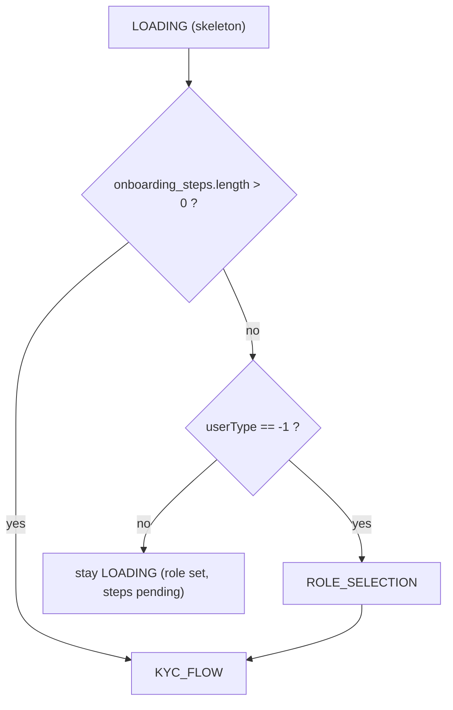
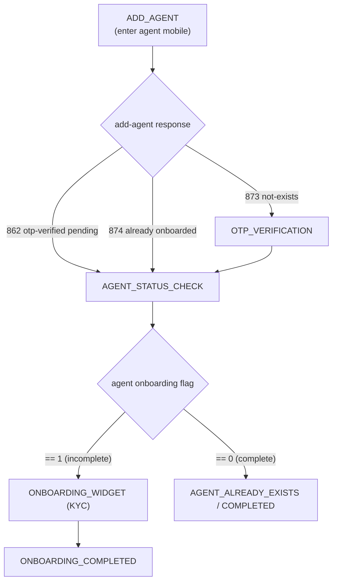
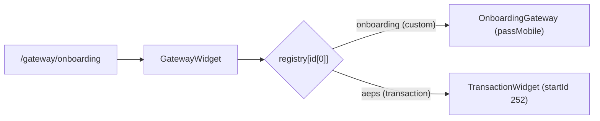
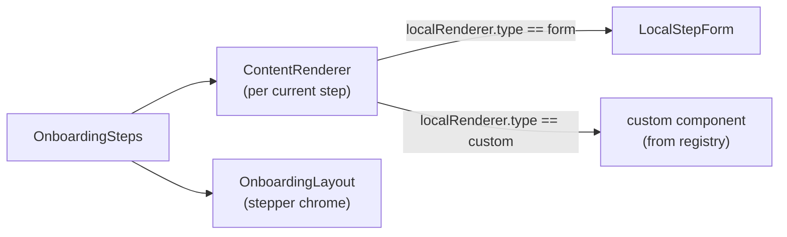

# Onboarding — Flows

New users complete a KYC onboarding flow before they can transact. All three flows are powered by one portable module — [features/onboarding/](/features/onboarding/) — and differ mainly in **who** is being onboarded and **whose token** the API calls use. The mechanics of how steps are defined, resolved, and rendered are in [onboarding-configuration.md](./onboarding-configuration.md).

## The three flows at a glance

| Flow | Route(s) | Page component | Onboarded subject | Token used |
|------|----------|----------------|-------------------|------------|
| **Self** | `/signup` | [SelfOnboarding/Onboarding.tsx](/features/onboarding/page-components/SelfOnboarding/Onboarding.tsx) | The logged-in user themselves | Logged-in user's token |
| **Assisted** | `/agent-onboarding`, `/admin/agent-onboarding` | [AssistedOnboarding.tsx](/features/onboarding/page-components/AssistedOnboarding/AssistedOnboarding.tsx) | An agent the admin is adding | Admin's token (agent profile fetched via `csp_id`) |
| **Gateway** (embedded) | `/gateway/onboarding` | [OnboardingGateway.tsx](/features/onboarding/page-components/OnboardingGateway/OnboardingGateway.tsx) | An agent logging in inside an embedded widget | The **agent's own** token |

> **Not to be confused:** `/onboard` and `/admin/onboard-agents` render the older [OnboardAgents](/page-components/Admin/OnboardAgents/OnboardAgents.jsx) admin component (individual / bulk-file / demo-account onboarding tabs), **not** the portable assisted flow above.

All three wrap their steps in an [OnboardingProvider](/features/onboarding/context/OnboardingContext.tsx), passing a `services` object (`accessToken`, `generateNewToken`, `isAndroid`, `pubsub`) defined by [contracts.ts](/features/onboarding/contracts.ts). That services boundary is why the same widget runs under three different tokens — see [onboarding-configuration.md](./onboarding-configuration.md#portable-module--services-boundary).

## Self-onboarding

Reached when a user logs in with `onboarding == 1` (or `RouteProtecter` force-redirects them to `/signup`).

[Onboarding.tsx](/features/onboarding/page-components/SelfOnboarding/Onboarding.tsx) builds `services`, then on mount calls `refreshAgentProfile()` → `POST /authentication/refresh-profile`. If the refreshed profile reports `onboarding !== 1`, the user is pushed to `/home`. Otherwise it renders [OnboardingWidget](/features/onboarding/components/OnboardingWidget.tsx).

`OnboardingWidget` is a small state machine over `LOADING → ROLE_SELECTION → KYC_FLOW`:

- **ROLE_SELECTION** → [RoleSelection.tsx](/features/onboarding/components/RoleSelection.tsx). Shown only when no role is assigned yet (`userType === -1`) and there are no steps. The user picks Retailer / Distributor / Enterprise; selecting submits `CREATE_PARTIAL_ACCOUNT` and refreshes the profile, then advances to `KYC_FLOW`. If exactly one role is available it auto-submits. A `?bv` (business vertical) URL param, when present, is also submitted here as `business_vertical`. Role visibility and the `?role` / `?bv` URL params are detailed in [onboarding-configuration.md](./onboarding-configuration.md#url-parameter-auto-fill).
- **KYC_FLOW** → [OnboardingSteps](/features/onboarding/components/OnboardingSteps.tsx) renders the dynamically-resolved step list inside the [OnboardingLayout](/features/onboarding/components/OnboardingLayout.tsx) stepper.

If self-onboarding is disabled for the org and the user has no role yet, `OnboardingWidget` shows a "User not found" screen with a Back button.

## Assisted onboarding (admin adds an agent)

[AssistedOnboarding.tsx](/features/onboarding/page-components/AssistedOnboarding/AssistedOnboarding.tsx) runs entirely under the **admin's** token but fetches the **agent's** profile by passing `csp_id = agentMobile` to `refresh-profile`; the result is held in local `agentDetails` state so the admin's global state is never overwritten.

Steps (`ASSISTED_ONBOARDING_STEPS`):

- [AddAgentForm](/features/onboarding/page-components/AssistedOnboarding/AddAgentForm.tsx) — agent mobile entry; submits `ASSISTED_ONBOARDING_ADD_AGENT`.
- [OtpVerificationForm](/features/onboarding/page-components/AssistedOnboarding/OtpVerificationForm.tsx) — verifies OTP for a brand-new agent (`VERIFY_ASSISTED_ONBOARDING_OTP`).
- [AgentStatusCheck](/features/onboarding/page-components/AssistedOnboarding/AgentStatusCheck.tsx) — fetches the agent profile and branches on the `onboarding` flag.
- `ONBOARDING_WIDGET` reuses [OnboardingWidget](/features/onboarding/components/OnboardingWidget.tsx) with `isAssistedOnboarding={true}` and `assistedAgentDetails`.
- [OnboardingCompleted](/features/onboarding/page-components/AssistedOnboarding/OnboardingCompleted.tsx) / [AgentAlreadyExistsScreen](/features/onboarding/page-components/AssistedOnboarding/AgentAlreadyExistsScreen.tsx) — offer "Onboard another agent" or go to `/home` / `/admin`.

Response-type ids used to branch (`RESPONSE_TYPE_IDS` in the same file):

| Id | Meaning |
|----|---------|
| `873` | Agent does not exist → needs OTP |
| `862` | OTP verified, onboarding pending |
| `874` | Agent already fully onboarded |
| `876` | OTP verification success |
| `302` | OTP verification error |

## Gateway (embedded / partner) onboarding

URL `/gateway/onboarding` ([pages/gateway/[...id].jsx](/pages/gateway/[...id].jsx)) → [GatewayWidget](/components/GatewayWidget/GatewayWidget.tsx). `GatewayWidget` is a generic dispatcher: it looks up the first path segment (`id[0]`) in `GATEWAY_PRODUCT_REGISTRY` ([GatewayProductRegistry.ts](/components/GatewayWidget/GatewayProductRegistry.ts)). The `onboarding` key maps to a **custom** product whose component is [OnboardingGateway](/features/onboarding/page-components/OnboardingGateway/OnboardingGateway.tsx) with `passMobile: true`. The whole gateway is gated by the `ELOKA_GATEWAY` feature flag, and the URL `?mobile=` param is forwarded to the component.

Inside `OnboardingGateway` (`ONBOARDING_GATEWAY_STEPS`):

- **ADD_AGENT** → embedded [LoginWidget](/page-components/LoginPanel/LoginWidget/LoginWidget.tsx) (`mode="embedded"`, OTP login, `initialMobile` from `?mobile=`). On `onLoginSuccess` it captures the agent's login response — **including the agent's own `access_token`** — into `agentDetails` and advances to the KYC widget.
- **ONBOARDING_WIDGET** → [OnboardingWidget](/features/onboarding/components/OnboardingWidget.tsx) driven by `agentServices`, which overrides `accessToken` with `agentDetails.access_token`. Every agent-side call (role selection, KYC steps, agreement signing) therefore uses the agent's token, not the host's.
- **ONBOARDING_COMPLETED** → shared [OnboardingCompleted](/features/onboarding/page-components/AssistedOnboarding/OnboardingCompleted.tsx).

## The KYC rendering chain (shared by all flows)

- [ContentRenderer](/features/onboarding/components/ContentRenderer.tsx) chooses between a config-driven form ([LocalStepForm](/features/onboarding/components/LocalStepForm.tsx)) and a named custom React component, based on `stepConfig.localRenderer.type`.
- [OnboardingLayout](/features/onboarding/components/OnboardingLayout.tsx) draws the stepper, titles, back button, and skip control.

The full set of available steps, how they are filtered per user, and how to add your own are in [onboarding-configuration.md](./onboarding-configuration.md).

## Completion tracking

A user's progress is a single profile flag, `onboarding`:

- `onboarding == 1` → in progress; `onboarding == 0` → complete.
- The flag is refreshed via `POST /authentication/refresh-profile` after relevant steps.
- It is consumed in two places: [UserContext.js](/contexts/UserContext.js) computes `isOnboarding = state?.onboarding == 1 || state?.userId == "1"`, and [RouteProtecter](/components/RouteProtecter/RouteProtecter.jsx) uses that (plus the `userId === "1"` sentinel) to force users into `/signup` until done. See [route-protection.md](./route-protection.md).
- Self-onboarding exits to `/home` once a refresh shows `onboarding !== 1`; assisted/gateway move to their "completed" screens when the agent profile shows `onboarding === 0`.
