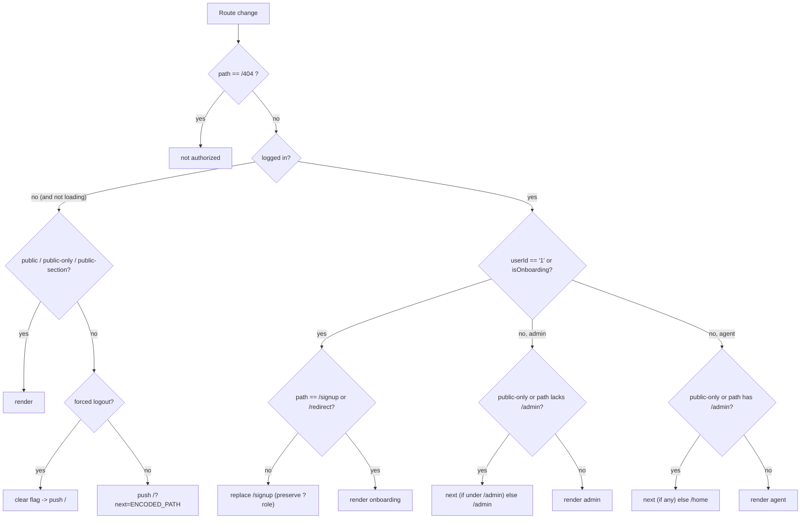

# Route Protection

[RouteProtecter](/components/RouteProtecter/RouteProtecter.jsx) is mounted high in the provider tree in [_app.tsx](/pages/_app.tsx) and re-runs its authorization check on every navigation. It reads session status from `useSession()` and route classification from [validRoutes.js](/constants/validRoutes.js).

## Route classification

There is **no explicit "protected routes" list**. Routes are classified by a few small allow-lists in [validRoutes.js](/constants/validRoutes.js); everything not on an allow-list is implicitly protected.

| Constant | Contents | Meaning |
|----------|----------|---------|
| `publicLinks` | `/privacy`, `/delete_my_account`, `/icons_demo`, `/test`, `/redirect`, `/gateway` | Reachable by anyone, logged in or not |
| `publicOnlyLinks` | `/` | Only for logged-**out** users (login page) |
| `publicSections` | `gateway` | Any sub-route whose first path segment is `gateway` is public |
| `baseRoute` | `{ admin: "/admin" }` | Admin's home base path |
| `initialRoute` | `{ admin: "/admin", "non-admin": "/home" }` | Post-login landing route per role |

**Protected = anything not matched by `publicLinks`, `publicOnlyLinks`, or `publicSections`.**

## Decision logic

`role = isAdmin ? "admin" : "non-admin"`. The effect runs on changes to `router.asPath`, `loading`, `isLoggedIn`, `userId`, `role`, and `isAdminAgentMode`.

### Logged-out user

If the path is not public, the user is redirected:

- If `inf-forced-logout === "1"`, that flag is cleared and the user is sent to `/` (the pre-logout route is **not** restored).
- Otherwise the user is sent to `/?next=<url-encoded original path>` so they return after login. (Paths `/`, `/home`, `/admin` are not stored as `next` — those just go to `/`.)

### Logged-in user — onboarding

If `userId === "1"` **or** `isOnboarding === true`, the user is force-redirected to `/signup` unless already on `/signup` or `/redirect`. The `?role` query param is **preserved** through this redirect so the onboarding flow can filter user types via the URL — the single source of truth shared with the embedded gateway flow (see [onboarding-configuration.md](./onboarding-configuration.md#url-parameter-auto-fill)).

### Logged-in admin

Base path is `/admin`. If the path is a public-only link or does not include `/admin`:

- In **Agent Mode** (`isAdminAgentMode`), `/products/*` routes are allowed through.
- Otherwise redirect to `next` (only if it starts with `/admin`) else `initialRoute.admin` (`/admin`).
- Agent-mode home swapping: `/admin` ↔ `/admin/home`.

### Logged-in agent (non-admin)

Base path is `/home`. If the path is a public-only link or contains `/admin`, redirect to `next` (if present) else `/home`. Otherwise authorized.

## Anti-flash spinner

To avoid flashing protected content before the check resolves, `RouteProtecter` renders a centered `<Spinner/>` while `loading` is true, or when the user is not logged in and the current path is not public. Authorized non-`/` routes are cached to `localStorage` as `inf-last-route`.

## Related

- Session flags used here (`isLoggedIn`, `isAdmin`, `isOnboarding`, `userId`) are produced in [session-tokens.md](./session-tokens.md).
- The onboarding redirect target (`/signup`) and what runs there is documented in [onboarding.md](./onboarding.md).
