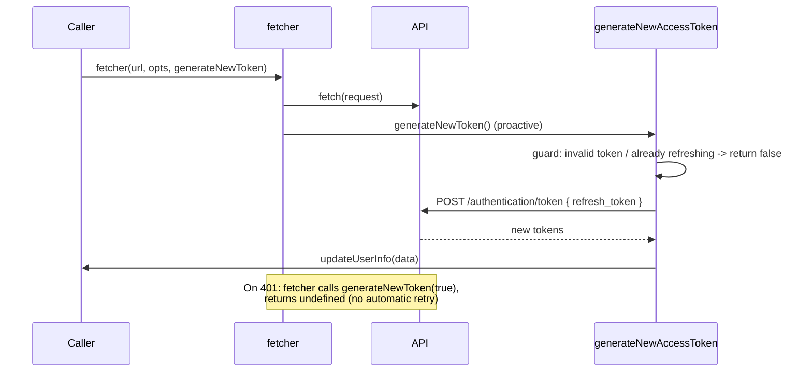
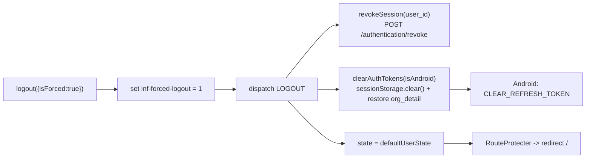

# Session & Tokens

How tokens are issued, stored, rehydrated, refreshed, and revoked. State lives in a reducer ([UserReducer.js](/contexts/UserReducer.js)) behind a provider ([UserContext.js](/contexts/UserContext.js)); helpers live in [loginHelper.js](/helpers/loginHelper.js); the network layer is [apiHelper.js](/helpers/apiHelper.js).

## The tokens

| Token | Purpose |
|-------|---------|
| `access_token` | Full token; authorizes transactions allowed by the user's assigned roles |
| `access_token_lite` | Light-weight token for regular/high-frequency transactions |
| `access_token_crm` | Token for the CRM API |
| `refresh_token` | Mints new access tokens; revoked server-side on logout |
| `token_timeout` | Not a token — the absolute expiry **timestamp (ms)** used to refresh proactively |

`useUser()` exposes `accessTokenLite` and `accessTokenCrm` with a fallback to `accessToken` when the specific token is absent.

## Storage layout

### sessionStorage (cleared when the tab/browser closes)

Written by `setandUpdateAuthTokens()` and `setUserDetails()` in [loginHelper.js](/helpers/loginHelper.js):

```
access_token, refresh_token, access_token_lite, access_token_crm
token_timeout
user_details, personal_details, shop_details, account_details, business_details
login_type            (Mobile | Google)
inf-forced-logout     ("1" after an explicit logout; preserved across clear)
org_detail            (preserved across clear)
```

### localStorage (persists across sessions)

```
inf-last-login        { type, name, mobile, user_id }  — for next-visit prefill
inf-last-route        last authorized route (and the in-progress OTP step)
inf-landing-page-cms  cached CMS landing-page data
```

`inf-last-login` is only written when the logged-in user's mobile has > 8 digits.

## Rehydration on app load

[UserContext.js](/contexts/UserContext.js) `UserProvider` runs once on mount:

1. `getSessions()` reads tokens + details out of `sessionStorage`.
2. If `access_token`, `details`, and `details.mobile` are all present, it builds state via `createUserState()` and dispatches `INIT_USER_STORE`.
3. Otherwise it sets `loading = false` and the user is treated as logged out.

`createUserState()` recomputes `token_timeout` through `getTokenExpiryTime()`: if the response already carries `token_timeout` it is used as-is; otherwise it is derived as `Date.now() + token_expiration * 0.75 * 1000` — i.e. **75 % of the token lifetime**.

## Reducer actions

[UserReducer.js](/contexts/UserReducer.js) is the single writer of auth state:

| Action | When |
|--------|------|
| `INIT_USER_STORE` | Rehydrate from `sessionStorage` (or mock data in tests) |
| `LOGIN` | After a successful login response — persists tokens + details |
| `UPDATE_USER_STORE` | Profile refresh / token rotation (`updateUserInfo`) |
| `LOGOUT` | Reset to `defaultUserState` |
| `UPDATE_SHOP_DETAILS` / `UPDATE_PERSONAL_DETAILS` / `SET_ADMIN_AGENT_MODE` | Targeted profile updates |

`login(sessionData, signup_mobile)` has one special case: for social signup where `details.onboarding === 1 && details.mobile === "1"`, it overrides `details.signup_mobile` with the verified number before dispatching `LOGIN`.

## Token refresh

Refresh is **proactive** (before expiry), not a transparent retry of failed requests. The flow involves [apiHelper.js](/helpers/apiHelper.js) `fetcher()` and `generateNewAccessToken()` in [loginHelper.js](/helpers/loginHelper.js).

`fetcher(url, options, generateNewToken)`:

- When a `generateNewToken` callback is passed, `fetcher` calls `generateNewToken()` **after dispatching the request** on every such call. The callback itself decides whether a refresh is actually warranted (it is guarded — see below).
- On an HTTP **401**, `fetcher` calls `generateNewToken(true)` and returns `undefined`. It does **not** retry the original failed request. If no callback was provided, it throws `UnauthorizedError`.



`generateNewAccessToken(refresh_token, updateUserInfo, isTokenUpdating, setIsTokenUpdating, logout)`:

- Returns `false` early if the refresh token is missing/too short, or if `isTokenUpdating` is already true (single-flight guard).
- Otherwise sets `isTokenUpdating = true`, posts to `/authentication/token`, and on success calls `updateUserInfo(data)`; on failure calls `logout()`.

> **Implementation note.** On the success path the function does not return a reliable boolean — the promise chain is not returned, so callers should not depend on a truthy/awaitable result. Also `.finally(setIsTokenUpdating(false))` invokes the setter **immediately** (its return value is passed to `.finally`) rather than after the request settles. Treat these as current behavior; do not document a dependable refresh result or strong de-duplication beyond the `isTokenUpdating` entry guard.

### Silent login from a refresh token

`loginUsingRefreshToken(refresh_token, updateUserInfo, login, logout, isAndroid)` ([loginHelper.js](/helpers/loginHelper.js)) turns a bare refresh token into a full logged-in session, with no user interaction:

1. raw-`fetch` `POST /authentication/token` (form-encoded) → new token set,
2. `setandUpdateAuthTokens()` writes them to `sessionStorage`,
3. `refreshUserProfile()` → `POST /authentication/refresh-profile` → `updateUserInfo(res)` + `login(res)` → `LOGIN` dispatch.

It returns the promise for the **whole** chain, so callers can show a loader until the profile has landed. A failure at either step is caught in one place: `logout()` (clearing any half-written session) plus `CLEAR_REFRESH_TOKEN` on Android.

Two callers:

- **Android** — [LayoutLogin](/layout-components/LayoutLogin/LayoutLogin.tsx) and [LayoutGateway](/layout-components/LayoutGateway/LayoutGateway.tsx) on the `CACHED_REFRESH_TOKEN` bridge action.
- **Web** — the `?refresh_token=` landing-page auto-login, see [login.md](./login.md#auto-login-via-refresh_token).

(Previously named `loginUsingRefreshTokenAndroid`; it is no longer Android-specific.)

## Access hooks

Two context hooks are exported from [UserContext.js](/contexts/UserContext.js):

### `useUser()` — full profile

`isLoggedIn`, `isAdmin`, `isAdminAgentMode`, `userId`, `userType`, `userTypeLabel`, `accessToken`, `accessTokenLite`, `accessTokenCrm`, `isOnboarding`, `userData` (the whole state), `login`, `logout`, `loading`, `setLoading`, `refreshUser`, `updateUserInfo`, `isTokenUpdating`, `setIsTokenUpdating`, `updateShopDetails`, `updatePersonalDetail`, `setAdminAgentMode`.

### `useSession()` — lightweight

`isLoggedIn`, `isAdmin`, `isAdminAgentMode`, `userId`, `userType`, `userTypeLabel`, `accessToken`, `accessTokenLite`, `accessTokenCrm`, `isOnboarding`, `loading`, `setLoading`, `refreshUser`, `logout`. No `userData`. Used by [RouteProtecter](/components/RouteProtecter/RouteProtecter.jsx) and other code that only needs session status.

`isOnboarding` is computed as `state?.onboarding == 1 || state?.userId == "1"` (note: the `userId` comparison is against the **string** `"1"`). See [route-protection.md](./route-protection.md) for how this drives redirects.

## Logout

Entry point [pages/logout/index.jsx](/pages/logout/index.jsx) shows "Logging out…" and calls `logout({ isForced: true })` from `useSession()`.



- `revokeSession(user_id)` ([loginHelper.js](/helpers/loginHelper.js)) posts `{ user_id, refresh_token }` to `/authentication/revoke` with a 5-second timeout. It **early-returns when `user_id === 1`** (numeric) — note this differs from the `isOnboarding` sentinel, which compares the **string** `"1"`. Keep this type difference in mind when touching either path.
- `clearAuthTokens(isAndroid)` backs up `org_detail` and `inf-forced-logout`, calls `sessionStorage.clear()`, restores those keys, and on Android fires `CLEAR_REFRESH_TOKEN`.
- The `inf-forced-logout` flag tells `RouteProtecter` not to restore the pre-logout route.

## Android bridge

When running inside the Android wrapper (`useAppSource().isAndroid`), tokens are mirrored to native storage via `doAndroidAction()` (`utils`):

- `SAVE_REFRESH_TOKEN` — on login, with `{ refresh_token, long_session, new_login }`.
- `CLEAR_REFRESH_TOKEN` — on logout / refresh failure.
- `OTP_FETCH_REQUEST` — to let the app auto-read the SMS OTP.
