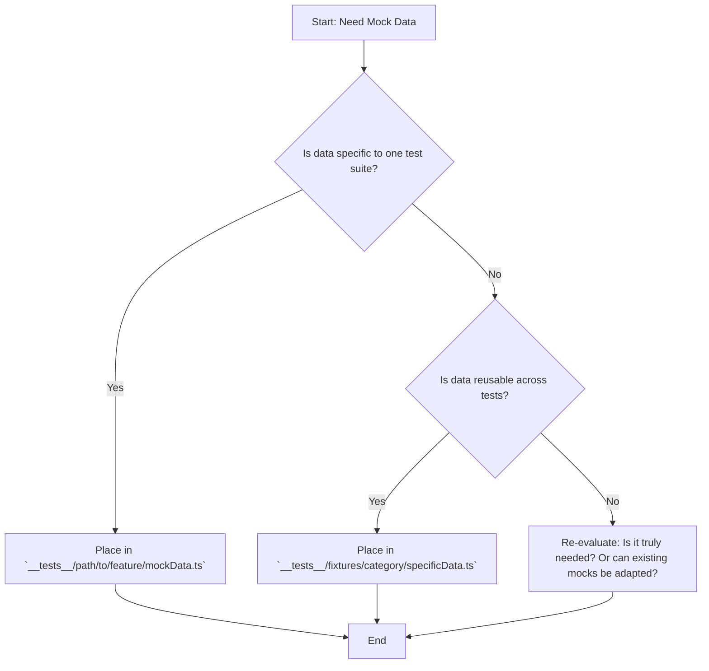

# Mock Data Storage Strategy

This document outlines the strategy for storing and managing mock data within the Eloka project, primarily used for testing purposes.

## Approach: Hybrid Model

We will adopt a hybrid approach, combining colocation for specific data with a centralized directory for shared data.

## Directory Structure and Conventions

1.  **`__tests__/fixtures/`:**
    *   This directory will house mock data that is intended to be **shared and reused** across multiple test suites.
    *   Organize data within this directory using logical subdirectories based on domain or data type (e.g., `__tests__/fixtures/users/`, `__tests__/fixtures/api/responses/`, `__tests__/fixtures/admin/`).
    *   Example: `__tests__/fixtures/users/standardUser.ts`, `__tests__/fixtures/api/responses/getProductsSuccess.ts`.

2.  **`__tests__/` (Colocated):**
    *   Mock data used **exclusively** by the tests for a specific component, hook, utility, or page should be placed directly within the corresponding `__tests__/` subdirectory, alongside the test file (`.test.tsx` or `.test.ts`).
    *   This keeps tightly coupled test data close to its usage.
    *   Example: `__tests__/components/Button/mockProps.ts` used only by `__tests__/components/Button/Button.test.tsx`.

## Decision Flowchart

